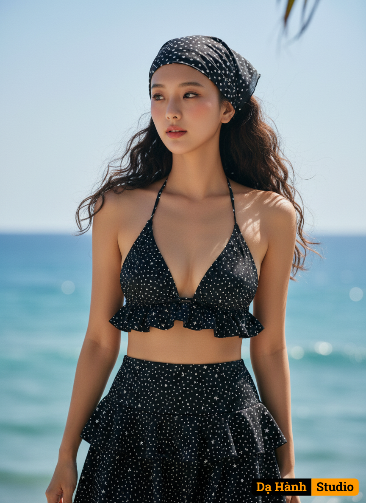

# AI Generated Image

## Details
- **Prompt:** `Create a realistic portrait of a young woman (face 100% identical to the original, no editing required).
Standing in a daze with a gentle gaze amidst a beautiful seascape.
The outfit consists of a bikini top and a mini skirt in a black polka dot pattern with matching small white stars. The bikini top features a deep-cut halter neckline and features ruffles at the top and bottom, adding a feminine touch. The skirt is short and features two layers of ruffles, creating a flowing and voluminous look.
Beyond the outfit itself, a headscarf, in the same pattern as the dress, is a key element that makes this look unique. This headscarf exudes a retro and sophisticated feel, enhancing the style of a simple bikini.
Makeup: Apply natural makeup for a soft, sweet look, while leaving skin fair and radiant. Light peachy pink blush and pink lips. Hairstyle: Long, loose curls. Camera details:
Used a Canon EOS R5 camera with an RF 85mm f/1.2L full-frame lens, f/1.4 aperture, and a maximum resolution of 8K for professional-quality clarity. Lighting: Natural daylight, with sunlight filtering through the leaves, creating soft shadows, creating a romantic atmosphere. A gentle breeze brightens the skin, blending seamlessly with the sea backdrop, as in the original image.`
- **Category:** Nhân vật
- **Source Images:**
  - [View Source](https://raw.githubusercontent.com/lenzcomvth/Somethings/main/Models/Female/Female3.jpg)

## Image
