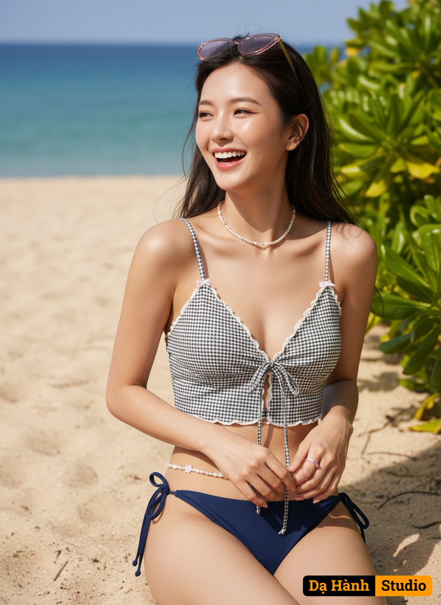

# AI Generated Image

## Details
- **Prompt:** `Create a hyper-realistic 8K full-body portrait in the style of a creative director (face
100% authentic, no editing required). A woman is lounging on
the sand, facing away from the sea, laughing and enjoying the view.
• Bottom: Dark blue tie-side bikini bottoms,
Small pink ring set on both middle fingers,
Beaded necklace, cute beaded waistband, and
Narrow pink sunglasses tied to her hair. Makeup:
Natural makeup for a sweet feel. Skin:
Smooth, peachy-orange blush, pink lips,
Light orange, large eyes with a light touch of eyeliner.
Distinctive Hairstyle: A slanted neckline, with a pair of hair slightly covering her face. Chanel sunglasses are worn
on her hair.
Camera Details: Canon EOS R5 camera, RF X5mm f/1.2L full-frame lens, f/1.4 aperture.
Maximum 8K resolution for realistic clarity.
Professional-grade.
• Top: Crop top, similar to a bra. Cropped Camisole Top
• Fabric pattern: White and dark silver checkerboard
• Thin camisole with a small bow tied at the top of the
strap (miniature bow decoration)
• Design: Deep V-neckline with a tie at the front, leaving
a slight opening at the center bottom, with small ruffles
along the front edge
Light: Natural daylight from the day, sunlight filtering through
Leaves create shadows
Soft, romantic, warm, sunlight
touching the skin and face, with a gentle breeze brightening the skin
Stunning and blending in with the sea backdrop`
- **Category:** Nhân vật
- **Source Images:**
  - [View Source](https://raw.githubusercontent.com/lenzcomvth/Somethings/main/Models/Female/Female3.jpg)

## Image
