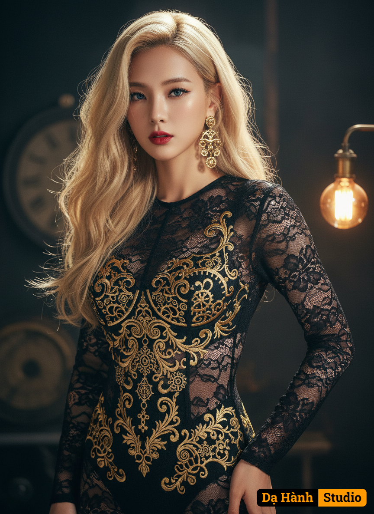

# AI Generated Image

## Details
- **Prompt:** `Subject: A beautiful woman with long, wavy blonde hair, striking blue eyes, and bold red lipstick.
​Camera Angle: Medium shot, eye-level.
​Pose: Standing, facing slightly towards the viewer, with a direct and confident gaze. Her right hand is gently resting at her side, and her left arm is slightly bent.
​Outfit: A highly detailed, intricate black lace bodysuit with long sleeves. The bodysuit features opulent gold embroidered patterns over the bust and midsection, creating a luxurious and somewhat steampunk-inspired aesthetic. The lace design includes sheer panels revealing parts of the skin. She is also wearing ornate gold dangle earrings.
​Lighting: Dramatic and somewhat moody, with warm tones emanating from a light source on the right side of the frame (possibly a bare bulb lamp visible in the background). This creates highlights on her hair and skin and emphasizes the gold details of her outfit. The background is dimly lit, enhancing the focus on the subject.
​Art Style: Photorealistic, with elements of fashion photography and potentially a touch of fantasy or steampunk influence due to the background elements. The image exhibits a high level of detail and a slightly stylized, artistic quality.`
- **Category:** Nhân vật
- **Source Images:**
  - [View Source](https://raw.githubusercontent.com/lenzcomvth/Somethings/main/Models/Female/Female3.jpg)

## Image
