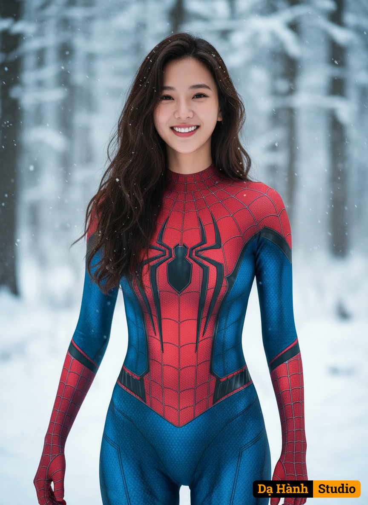

# AI Generated Image

## Details
- **Prompt:** `Edit my picture and use the attached photo as reference for 100% accurate facial features, cheerful expression. A realistic portrait of a woman dressed in a detailed Spider-Man costume, featuring a red and blue bodysuit with black web patterns and a prominent black spider emblem on the chest. She has long, wavy black hair with snowflakes resting on it, and is smiling confidently. The background is a snowy, wintery forest scene with blurred trees and snow-covered ground, creating a soft, cool atmosphere that contrasts with her vibrant costume. The lighting is natural and even, highlighting her facial features and the texture of the costume. Using a Canon EOS R camera with a 50mm f/1.8 lens, f/2.2 aperture, shutter speed 1/200s, ISO 100 and natural light, Full Body, Hyper Realistic Photography, Cinematic, Cinema, Hyper detail, Ultra hd, Color Correction, ultra hd, hdr, color grading, 8k. 9:16`
- **Category:** Nhân vật
- **Source Images:**
  - [View Source](https://raw.githubusercontent.com/lenzcomvth/Somethings/main/Models/Female/Female3.jpg)

## Image
