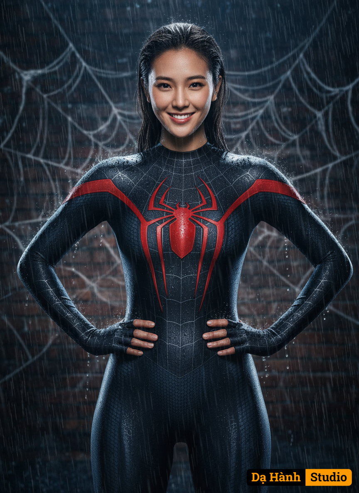

# AI Generated Image

## Details
- **Prompt:** `Edit my picture and use the attached photo as reference for 100% accurate facial features, cheerful expression. A highly detailed, realistic image of a woman dressed as Spider-Man in a sleek, black, form-fitting superhero suit with a textured pattern and prominent spider emblem on the chest. The suit features a web design with a glossy finish, accentuating her athletic physique. She stands confidently with a slight smile, wet hair slicked back, against a background of rain and illuminated spider webs. The scene has a dark, moody atmosphere with dramatic lighting highlighting the suit's details and the wet, rain-soaked environment. The background includes blurred brick walls and glowing spider web strands, creating a dynamic, action-ready vibe. Using a Canon EOS R camera with a 50mm f/1.8 lens, f/2.2 aperture, shutter speed 1/200s, ISO 100 and natural light, Full Body, Hyper Realistic Photography, Cinematic, Cinema, Hyper detail, Ultra hd, Color Correction, ultra hd, hdr, color grading, 8k. 9:16`
- **Category:** Nhân vật
- **Source Images:**
  - [View Source](https://raw.githubusercontent.com/lenzcomvth/Somethings/main/Models/Female/Female3.jpg)

## Image
