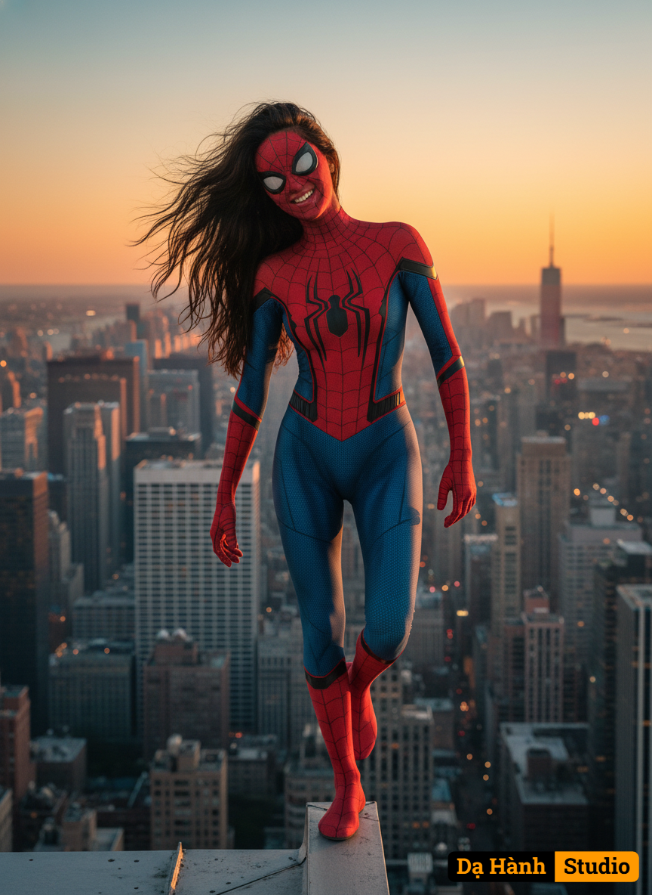

# AI Generated Image

## Details
- **Prompt:** `Edit my picture and use the attached photo as reference for 100% accurate facial features, cheerful expression. A highly detailed, realistic image of a young woman dressed as Spider-Man, balancing on the edge of a tall skyscraper rooftop at sunset. She is wearing a form-fitting, vibrant red and blue Spider-Man suit with a black spider emblem on her chest, intricate web patterns, and matching gloves and boots. Her long, dark hair flows in the wind, and she has an intense, focused expression. The background showcases a sprawling cityscape with numerous illuminated buildings, and the sky is painted with warm hues of orange and yellow from the setting sun, fading into a darker blue as it reaches higher. The scene captures a sense of daring heroism and urban adventure. Using a Canon EOS R camera with a 50mm f/1.8 lens, f/2.2 aperture, shutter speed 1/200s, ISO 100 and natural light, Full Body, Hyper Realistic Photography, Cinematic, Cinema, Hyper detail, Ultra hd, Color Correction, ultra hd, hdr, color grading, 8k. 9:16 `
- **Category:** Nhân vật
- **Source Images:**
  - [View Source](https://raw.githubusercontent.com/lenzcomvth/Somethings/main/Models/Female/Female3.jpg)

## Image
