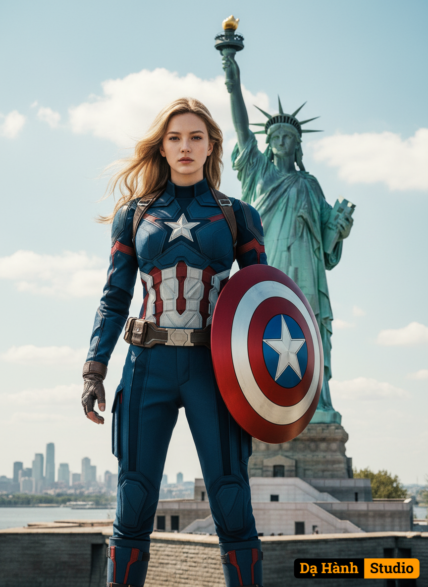

# AI Generated Image

## Details
- **Prompt:** `Edit my picture and use the attached photo as reference for 100% accurate facial features, cheerful expression A highly detailed, realistic image of a female superhero standing confidently in front of the Statue of Liberty. She is dressed in a blue, red, and white tactical suit with a prominent star emblem on her chest, resembling Captain America's costume. She holds a large, round shield with a star in the center, matching her suit's color scheme. Her blonde hair is flowing slightly in the breeze, and she has a serious, determined expression on her face. The background features a bright, partly cloudy sky and the iconic Statue of Liberty on Liberty Island, with an urban landscape and water in the distance. The scene exudes strength, heroism, and American patriotism. Using a Canon EOS R camera with a 50mm f/1.8 lens, f/2.2 aperture, shutter speed 1/200s, ISO 100 and natural light, Full Body, Hyper Realistic Photography, Cinematic, Cinema, Hyper detail, Ultra hd, Color Correction, ultra hd, hdr, color grading, 8k. 9:16 `
- **Category:** Nhân vật
- **Source Images:**
  - [View Source](https://raw.githubusercontent.com/lenzcomvth/Somethings/main/Models/Female/Female3.jpg)

## Image
