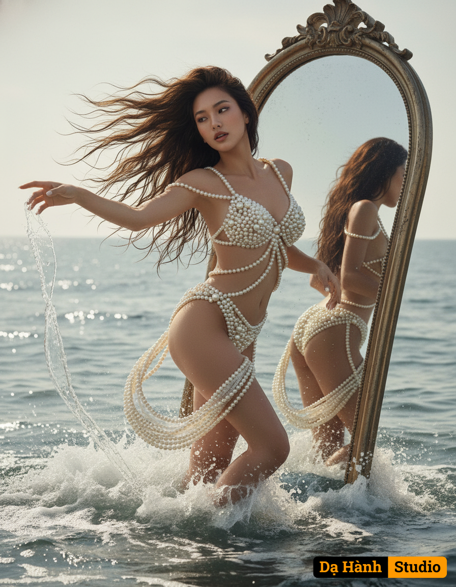

# AI Generated Image

## Details
- **Prompt:** `An ultra realistic photo, a conceptual portrait with a distinctly dreamlike and ethereal atmosphere. She is ascending gracefully from the ocean and sea foam, her body arcing elegantly, one arm outstretched as if beckoning, water streaming from her fingertips, like a modern day mythical goddess Aphrodite. Her long dark hair, wet and flowing, cascades dramatically around her. She is wearing what appears to be a two piece swimsuit made of cream colored pearls, the pearls draping off her shoulder and elegantly wrapping her body. Behind her, a huge vintage mirror emerges from the sea, showing her reflection from the back. The entire scene is captured from a dynamic low-angle, slightly canted perspective, emphasizing her powerful, divine emergence against the vast, shimmering ocean. Inspired by aesthetics of classical mythology art.`
- **Category:** Nhân vật
- **Source Images:**
  - [View Source](https://raw.githubusercontent.com/lenzcomvth/Somethings/main/Models/Female/Female3.jpg)
  - [View Source](https://raw.githubusercontent.com/lenzcomvth/Somethings/main/Models/Female/Facebook (4).jpg)

## Image
