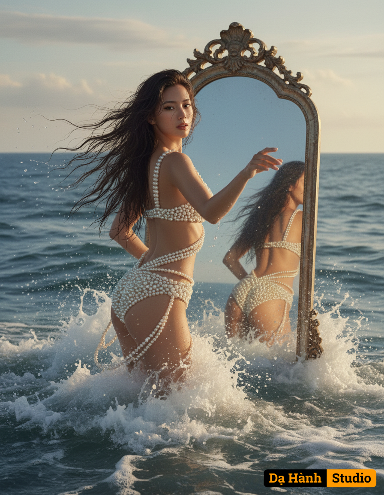

# AI Generated Image

## Details
- **Prompt:** `An ultra realistic photo, a conceptual portrait with a distinctly dreamlike and ethereal atmosphere. A modern day mythical goddess Aphrodite emerges from the ocean and sea foam, her body gracefully arching as she ascends, one arm slightly extended as if reaching towards the viewer. This dynamic emergence is captured from a compelling, slightly low-angle perspective, highlighting her ethereal presence against the vast sea. Her long dark hair, wet and flowing, cascades dramatically around her shoulders. She wears a two-piece swimsuit made of cream colored pearls, elegantly arranged and delicately draped, wrapping her body. Behind her, a huge vintage mirror emerges from the sea, perfectly positioned to capture her reflection from the back. The scene is inspired by aesthetics of classical mythology art, with meticulous attention to facial features.`
- **Category:** Nhân vật
- **Source Images:**
  - [View Source](https://raw.githubusercontent.com/lenzcomvth/Somethings/main/Models/Female/Female3.jpg)
  - [View Source](https://raw.githubusercontent.com/lenzcomvth/Somethings/main/Models/Female/Facebook (4).jpg)

## Image
