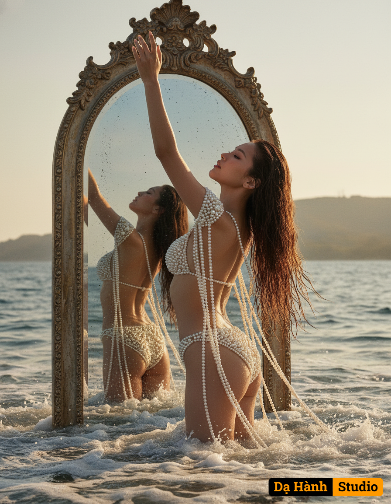

# AI Generated Image

## Details
- **Prompt:** `Create an ultra realistic photo this is a conceptual portrait with distinctly dreamlike and ethereal atmosphere. She is captured from a dramatic, slightly low-angle perspective, with the camera just above the water line, as she gracefully arches her back and rises majestically from the ocean and sea foam, her head tilted slightly upward and one arm elegantly extended, like a modern day mythical goddess Aphrodite. Her long dark hair wet and falling gracefully. She is wearing what appears to be a two piece swimsuit made of cream colored pearls behind her in the ocean huge vintage mirror emerges from the sea as well showing her reflection from the back the pearls drape off her shoulder in and wraps her body delicately and are elegantly arranged. Inspired by aesthetics of classical mythology art.`
- **Category:** Nhân vật
- **Source Images:**
  - [View Source](https://raw.githubusercontent.com/lenzcomvth/Somethings/main/Models/Female/Female3.jpg)
  - [View Source](https://raw.githubusercontent.com/lenzcomvth/Somethings/main/Models/Female/Facebook (4).jpg)

## Image
