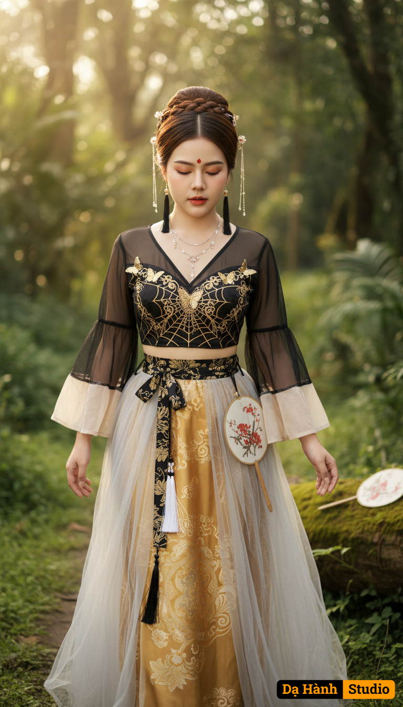

# AI Generated Image

## Details
- **Prompt:** `Ultra-photorealistic cinematic portrait, 8K sharpness, vertical 9:16. Preserve the exact face identity from the uploaded reference photo — 100% locked facial structure. A beautiful young East Asian woman with fair skin, serene expression, and eyes gently closed, a delicate red bindi on her forehead. Her dark brown hair is elaborately styled into a high bun with intricate braids, adorned with delicate silver chain headpieces and small floral pins. She wears subtle peach-toned makeup with soft lips. She is wearing a flowing, traditional Chinese/fantasy-inspired outfit. The top is a black sheer V-neck crop top with wide, translucent bell sleeves (featuring light beige/cream sections) and golden butterfly appliques and intricate gold web-like embroidery on the bodice. Her high-waisted skirt has a golden inner layer with elaborate patterns, covered by a sheer, light grey/silver tulle outer layer. A black and gold patterned belt with a black ribbon bow and white and black tassels cinches her waist. She wears multiple delicate silver necklaces and long black tassel earrings. A white folding fan with intricate red floral designs rests on the moss-covered log beside her. In a lush, verdant forest. The background features deep green foliage with a soft, dreamy bokeh effect. She is slowly walking through the verdant forest, looking gently down at her feet, the fan tucked delicately into her belt. Full body shot, slightly tracking, portrait orientation. Soft, warm, diffused golden hour sunlight filtering through the trees, creating a gentle backlit glow around her hair and shoulders, illuminating her face softly. Ethereal, mystical, tranquil, fine art portraiture, cinematic, fantasy fashion aesthetic.`
- **Category:** Nhân vật
- **Source Image:** [View Source](https://raw.githubusercontent.com/lenzcomvth/ImageLibrary/main/Female.png)

## Image
