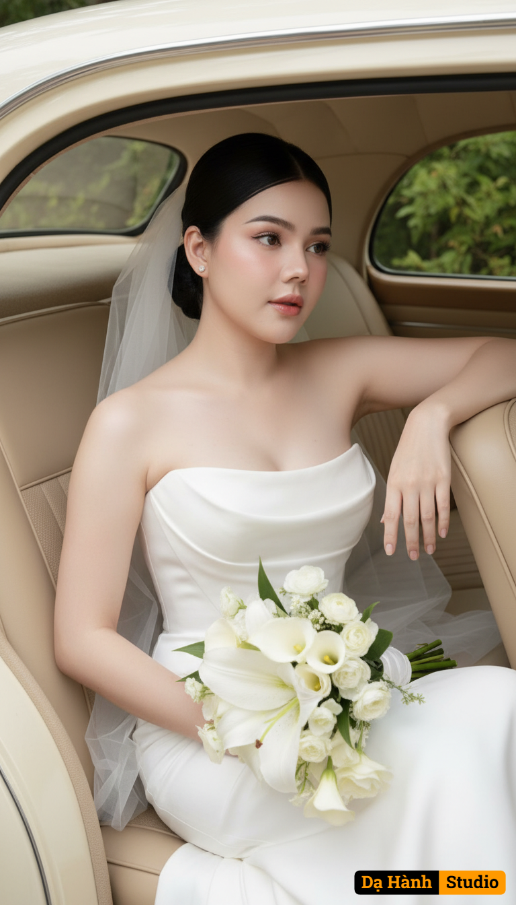

# AI Generated Image

## Details
- **Prompt:** `Use the exact face and figure of the woman in the attached photo (face, eyes, facial structure, eyebrows, nose, lips, and body must be 100% identical—no modifications allowed).
A romantic bridal portrait of the bride sitting gracefully in the backseat of a cream-colored vintage car, with her upper body leaning elegantly out of the window.
Outfit:
The bride wears a strapless white wedding gown with a timeless minimalist design. The soft, flowing fabric drapes naturally across the seat, creating an elegant and graceful look. A delicate sheer veil adds an airy touch of romance. Resting on her lap is a bouquet of white flowers, featuring lilies, calla lilies, and fresh light-green leaves, enhancing the freshness and romantic mood.
Makeup:
Porcelain-smooth glowing skin, with a soft flush of light pink on the cheeks. Lips are glossy in a subtle pink tone. Her eyes are defined with thin eyeliner and soft, fluttery lashes, while her naturally arched brows frame her face with elegance.
Hairstyle:
Her black hair is styled into a sleek low bun with a clean center part. A few loose strands fall gently along her face, adding softness and a romantic charm.
Pose:
The bride leans halfway out of the backseat window with elegance. One arm rests gently on the lower edge of the car window, while the other holds the bouquet. Her gaze drifts dreamily outside, with an expression full of serenity and poetic grace.
Background:
Inside the vintage car with beige leather seats and soft cream details, radiating warmth. Through the window, lush green trees can be seen outside, creating a refreshing and romantic backdrop.
Lighting & Colors:
Soft natural light from outside highlights her radiant skin and the glowing white gown. The overall palette—white, cream, beige, and green—evokes a timelessly romantic, warm, and elegant atmosphere. (1/2)`
- **Category:** Nhân vật
- **Source Image:** [View Source](https://raw.githubusercontent.com/lenzcomvth/ImageLibrary/main/Female.png)

## Image
