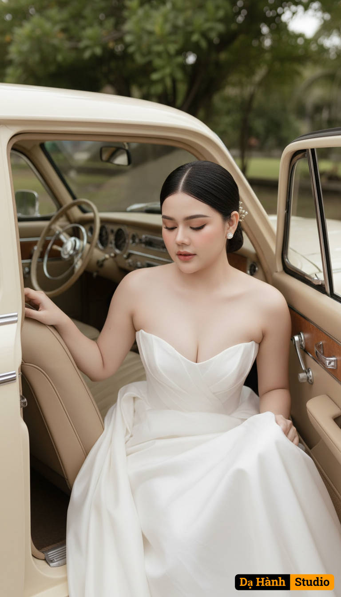

# AI Generated Image

## Details
- **Prompt:** `Use the exact face and figure of the woman in the attached photo (face, eyes, facial structure, eyebrows, nose, lips, and body must be 100% identical—no modifications allowed).
A romantic bridal portrait of the bride gracefully stepping out of a cream-colored vintage car.
Outfit:
The bride wears a strapless white wedding gown with a refined and classic design. The light, flowing fabric enhances her graceful, timeless look. As she leans forward, the gown naturally spreads and flows, adding movement and romance to the scene.
Makeup:
Soft and delicate tones with a healthy, glowing porcelain complexion. Cheeks have a gentle pink flush, lips are a light soft pink, eyes defined with subtle eyeliner and naturally fluttery lashes. Her brows are simple and natural in shape, complementing the overall elegance.
Hairstyle:
Her black hair is styled into a sleek low bun with a clean center part. A few loose strands frame her face softly, enhancing her tenderness. She wears vintage pearl earrings, adding a touch of timeless charm.
Pose:
The bride leans slightly forward, with one hand resting on the car seat and the other gently holding her gown. Her eyes are softly closed, expressing serenity, grace, and romantic elegance.
Background:
The setting is inside a classic vintage car with beige leather seats, a cream-toned console, and an old-fashioned steering wheel. The car is parked outdoors, with lush green trees in the background that add freshness and warmth to the atmosphere.
Lighting & Colors:
Warm natural light illuminates her glowing skin and the flowing dress. The overall color palette—white, cream, beige, and green—creates a romantic, classic, and vintage feeling.
Overall Style:
A high-quality pre-wedding photograph—elegant, luxurious, cinematic, and dreamily romantic. Captured as a detailed close-up shot suitable for editorial or magazine use, photographed with a Canon EOS R5 and an 85mm f/1.2 lens at aperture f/1.2, producing an ultra-shallow depth of field. Her skin and body appear smooth and luminous like porcelain, with a refined fashion aesthetic that highlights intricate details. Aspect ratio: 3:4.`
- **Category:** Nhân vật
- **Source Image:** [View Source](https://raw.githubusercontent.com/lenzcomvth/ImageLibrary/main/Female.png)

## Image
