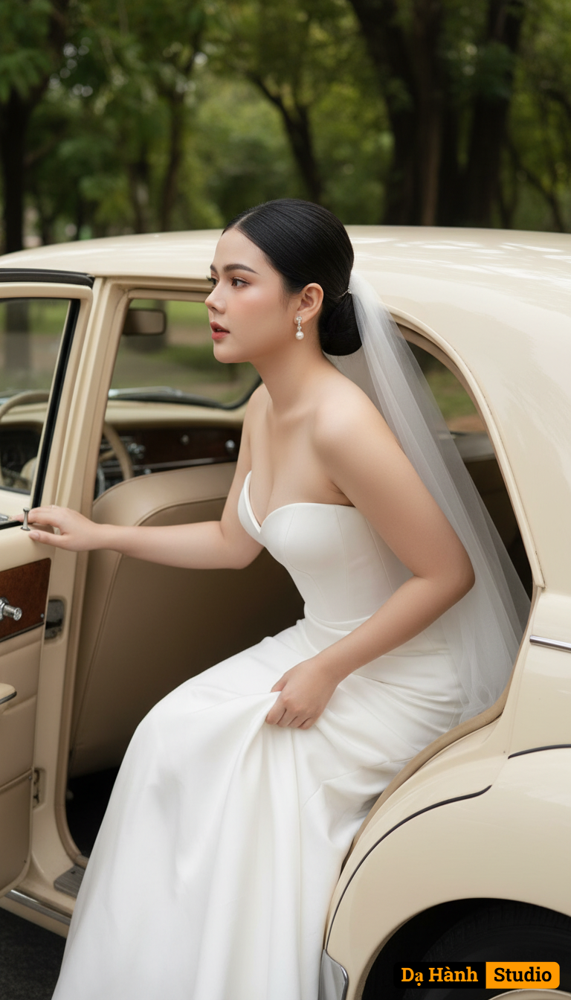

# AI Generated Image

## Details
- **Prompt:** `Use the exact face and figure of the woman in the attached photo (face, eyes, facial structure, eyebrows, nose, lips, and body must be 100% identical—no modifications allowed). A romantic bridal portrait of the bride gracefully stepping out of a cream-colored vintage car. Outfit: The bride wears a strapless white wedding gown with a refined, classic design. The light, flowing fabric enhances her graceful and timeless look. As she leans outward, the gown spreads naturally, adding movement and romance to the scene. A delicate bridal veil drapes softly over her hair, adding a touch of ethereal elegance. Makeup: Sweet and soft tones with a healthy, glowing porcelain complexion. Cheeks carry a gentle pink flush, lips are a light soft pink. Her eyes are defined with subtle eyeliner and naturally fluttery lashes. Brows are simple and natural, completing the delicate look. Hairstyle: Her black hair is styled into a sleek low bun with a neat center part. A few soft strands frame her face, adding tenderness. She wears vintage pearl earrings that enhance her classic charm. Pose: The bride stands beside the car, one hand resting on the car door while the other gently holds her gown. Her gaze is turned away from the camera, expressing serenity, grace, and romance. Background: The setting is a classic vintage car interior with beige leather seats, a cream-toned console, and an old-fashioned steering wheel. The car is parked outdoors, surrounded by lush green trees that add freshness and warmth to the atmosphere. Lighting & Colors: Warm natural light highlights her radiant skin and the flowing gown. The overall color palette—white, cream, beige, and green—creates a romantic, classic, and vintage mood. Overall Style: A high-quality pre-wedding photograph—elegant, luxurious, cinematic, and dreamily romantic. Captured as a detailed close-up shot suitable for editorial or magazine use, photographed with a Canon EOS R5 and an 85mm f/1.2 lens at aperture f/1.2, producing an ultra-shallow depth of field. Her skin and body appear smooth and luminous like porcelain, with a refined fashion aesthetic that highlights every detail. Aspect ratio: 3:4.`
- **Category:** Nhân vật
- **Source Image:** [View Source](https://raw.githubusercontent.com/lenzcomvth/ImageLibrary/main/Female.png)

## Image
