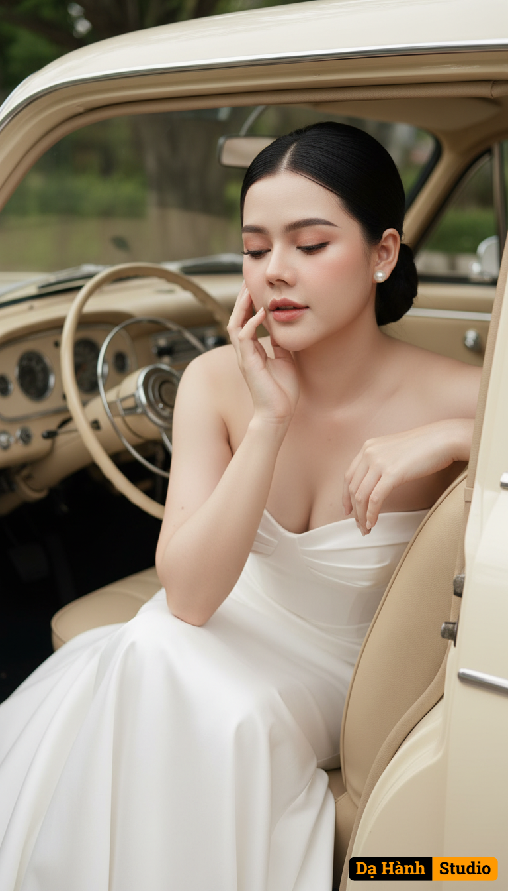

# AI Generated Image

## Details
- **Prompt:** `Use the exact face and figure of the woman in the attached photo (face, eyes, facial structure, eyebrows, nose, lips, and body must be 100% identical—no modifications allowed). A romantic bridal portrait of the bride gracefully stepping out of a cream-colored vintage car. Outfit: The bride wears a strapless white wedding gown with a refined, classic design. The fabric is light and flowing, enhancing her graceful and timeless appearance. As she leans forward, the gown spreads naturally, creating a sense of movement and romance. Makeup: Soft and delicate tones with a healthy, glowing fair complexion. Her cheeks carry a gentle pink flush, lips are a light pink shade. The eyes are defined with thin eyeliner and natural fluttery lashes, while the brows are simple and natural in shape. Hairstyle: Her black hair is styled into a sleek low bun with a clean center part. A few loose strands frame her face, adding softness. She wears vintage pearl earrings that bring a touch of classic elegance. Pose: The bride with a hand gently touching her cheek, eyes closed slightly as if lost in a beautiful thought, a soft, dreamlike expression. Background: Inside a classic vintage car with beige leather seats, a cream-toned console, and an old-fashioned steering wheel. The car is parked outdoors with green trees in the background, adding freshness and warmth to the atmosphere. Lighting & Colors: Warm natural light illuminates her glowing skin and the flowing gown. The overall palette—white, cream, beige, and green—creates a romantic, classic, and vintage ambiance. Overall Style: A high-quality pre-wedding photograph—elegant, luxurious, cinematic, and dreamily romantic. Captured as an extreme close-up on her face, emphasizing the delicate makeup, serene mood, and the intricate details of her facial features, suitable for editorial or magazine use, photographed with a Canon EOS R5 and an 85mm f/1.2 lens at aperture f/1.2, producing an ultra-shallow depth of field. Her skin and body appear smooth and luminous like porcelain, with a refined fashion aesthetic that emphasizes intricate details. Aspect ratio: 3:4.`
- **Category:** Nhân vật
- **Source Image:** [View Source](https://raw.githubusercontent.com/lenzcomvth/ImageLibrary/main/Female.png)

## Image
