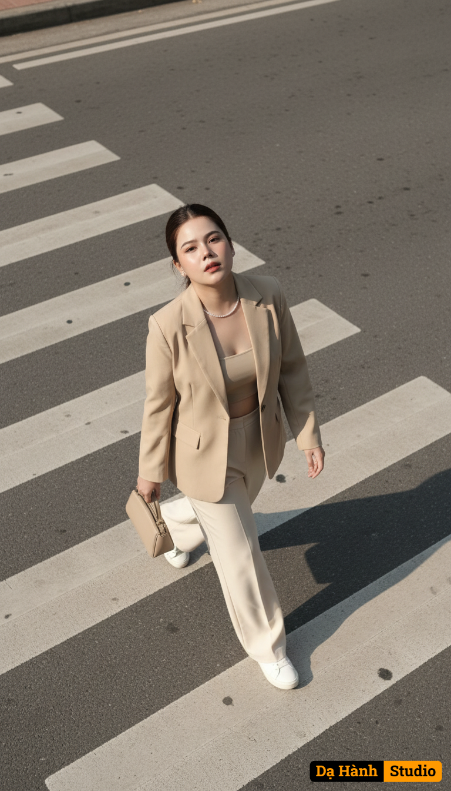

# AI Generated Image

## Details
- **Prompt:** `Use the exact real face from the attached photo, 100% unchanged.The image depicts a single individual captured mid-stride across a zebra crossing, photographed from an elevated overhead angle, emphasizing the diagonal lines of the pedestrian pathway, captured from an elevated overhead angle as she gazes upward directly at the camera. The subject wears a tailored beige blazer over a matching outfit, fabric crisp, paired with wide-leg cream trousers flowing naturally, complemented by sneakerr shoes. Her hair, dark and sleek, frames her face as she tilts her head back, strands catching the light. She carries a beige handbag in her right hand, left hand relaxed by her side. Lighting emanates from a soft natural source above, casting a muted golden glow across the scene, interacting with the asphalt to create subtle reflections, shadows stretching sharply to the right with moderate intensity. The color palette leans toward desaturated tones, dominated by earthy beige and gray hues, enhanced by minimal grain noise indicative of high-resolution digital capture. The overall style reflects a minimalist urban aesthetic, achieved through a wide-angle lens with a moderate aperture, likely a 35mm focal length, employing a shallow depth of field to isolate the subject against the blurred background. Her posture, upright with head tilted back, conveys an intentional upward gaze, the gesture suggesting curiosity engagement. `
- **Category:** Nhân vật
- **Source Image:** [View Source](https://raw.githubusercontent.com/lenzcomvth/ImageLibrary/main/Female.png)

## Image
