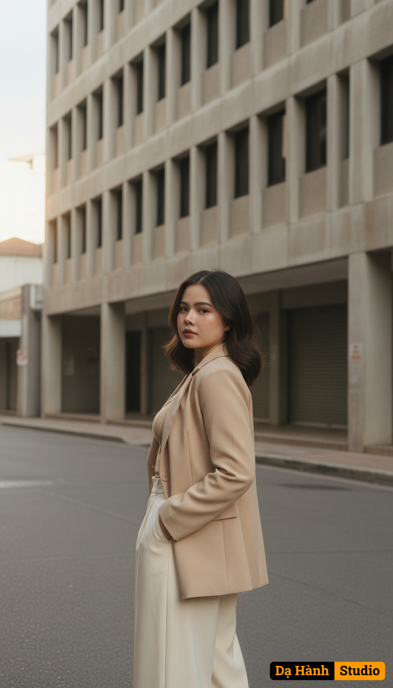

# AI Generated Image

## Details
- **Prompt:** `Use the exact real face from the attached photo, 100% unchanged. The image portrays a single individual standing on an urban street, captured from a side angle with a slight rear perspective, positioned against the backdrop of a tall concrete building featuring a grid of rectangular windows. The subject wears a tailored beige blazer over a matching outfit, fabric crisp, paired with wide-leg cream trousers flowing naturally. Her hair, dark and shoulder-length, falls naturally with a slight wave, framing her face as she turns her head slightly to the left. Lighting originates from a soft diffused source above, enriched by warm sunlight streaming from the west, casting a golden glow across the scene, interacting with the building facade to create gentle shadows that fall to the right with moderate sharpness, the sunlight highlighting her hair and coat with a radiant sheen. The color palette embraces desaturated tones, dominated by beige and gray hues, enhanced by subtle grain noise indicative of a high-resolution digital capture with a film-like quality. The overall style aligns with a sophisticated urban aesthetic, achieved through a wide-angle lens with a moderate aperture, likely a 35mm focal length, employing a shallow depth of field to blur the background. Her posture, upright with a subtle tilt of the head, conveys a poised confidence, the gesture suggesting a moment of contemplation. `
- **Category:** Nhân vật
- **Source Image:** [View Source](https://raw.githubusercontent.com/lenzcomvth/ImageLibrary/main/Female.png)

## Image
