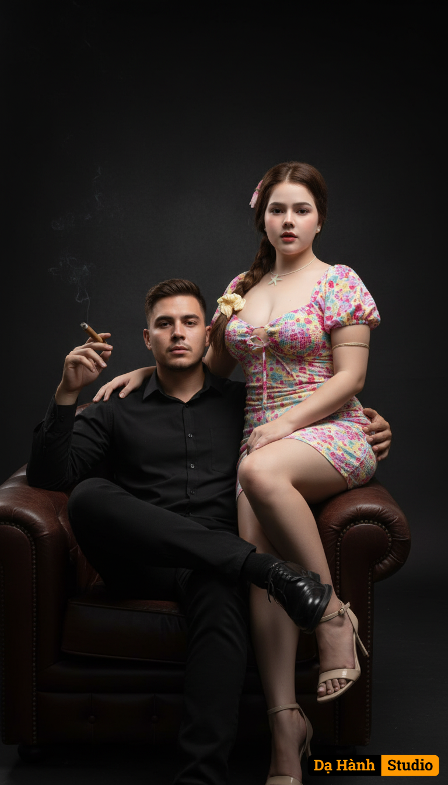

# AI Generated Image

## Details
- **Prompt:** `A hyper-realistic portrait
 of a mafia-couple in a studio setting with a dark background in shades of black and deep gray, illuminated with dramatic low-key lighting that highlights their faces and outfits with cinematic contrast.
 The man and the woman look exactly the same as in the reference photo you uploaded their faces, hair, skin tone, and outfits remain completely unchanged.
 The man sits in a large single leather sofa, leaning back in a relaxed but powerful manner.
 One leg is crossed over the other in a calm, confident pose.
 His left arm rests casually on the sofa's armrest, holding a lit cigar in true mafia style.
 His other arm is gently wrapped around the woman's waist, resting at her hip in a natural, protective gesture.
 His expression is calm, confident, and slightly stern, embodying the quiet dominance of a mafia boss.
 The woman sits gracefully and naturally on **one of the man's thighs**, her posture relaxed yet elegant.
 She leans in slightly toward him, her right arm resting lightly across his shoulder, while her other arm rests gently on her lap.
 She wears the same **tight, hug-body dress** from the uploaded photo, which fits closely and **accentuates her natural hourglass figure with a fuller bust**, yet still looks tasteful and refined.
 Her expression is soft yet confident, gazing directly at the camera.
 The background is a minimalist dark studio wall in shades of black and deep gray, with controlled dramatic low-key lighting that creates soft highlights on their faces and clothes while keeping the background in subtle shadow.
 Ultra-realistic details, sharp focus, smooth natural shadows, 1080×1920 portrait ratio, classy and powerful mafia-couple vibe.`
- **Category:** Nhân vật
- **Source Image:** [View Source](https://raw.githubusercontent.com/lenzcomvth/ImageLibrary/main/Female.png)

## Image
