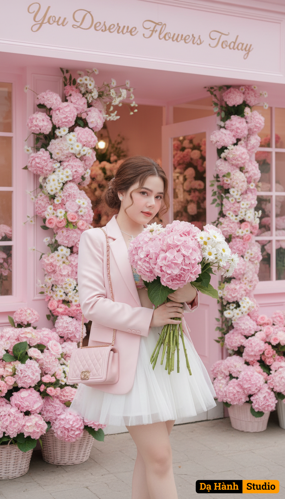

# AI Generated Image

## Details
- **Prompt:** `A hyper-realistic 8K cinematic portrait of the same woman (keep the attached face 100% identical, no changes to facial details).
She is wearing a white tutu mini dress layered with a pastel pink blazer. Her hair is styled in a loose bun with a few soft strands falling gracefully. She carries a pink Chanel shoulder bag and holds a large bouquet of pink hydrangeas and daisies.
Pose: standing with legs crossed, gazing softly at the bouquet.
Scene: in front of a pastel pink flower shop, decorated with hydrangea and daisy arrangements everywhere, with a stylish sign that reads “You Deserve Flowers Today.”
Lighting: dreamy pastel tones, cinematic soft light, luxury editorial photography style.
Mood: pastel romantic, dreamy, feminine, elegant, luxury magazine cover aesthetic.
Ultra-detailed, sharp focus, breathtaking realism.

Negative Prompt: blurry, distorted face, face changed, extra fingers, messy background, low resolution, oversaturated colors, cartoon style, painting, text error.`
- **Category:** Nhân vật
- **Source Image:** [View Source](https://raw.githubusercontent.com/lenzcomvth/ImageLibrary/main/Female.png)

## Image
