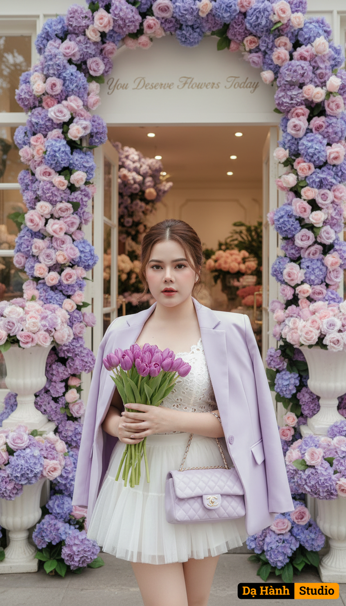

# AI Generated Image

## Details
- **Prompt:** `A hyper-realistic 8K cinematic portrait of the same woman (keep the attached face 100% identical, no modifications).
She is wearing a short white tutu dress paired with a pastel lavender blazer and a delicate embroidered top. Her hair is styled in a loose bun with soft strands framing her face. She carries a pastel lavender Chanel shoulder bag and holds a bouquet of purple tulips.
Pose: standing gracefully, holding the bouquet close, looking softly ahead.
Scene: in front of a luxurious flower shop, fully decorated with pastel purple hydrangeas and roses, with a sign above that reads “You Deserve Flowers Today.”
Lighting: soft pastel tones, natural daylight, cinematic editorial photography.
Mood: romantic, feminine, dreamy, luxury magazine cover style.
Ultra-detailed, sharp focus, natural skin texture, breathtaking realism.

Negative Prompt: distorted face, altered face, blurry, painting style, cartoon, extra fingers, oversaturated colors, messy background, text errors.`
- **Category:** Nhân vật
- **Source Image:** [View Source](https://raw.githubusercontent.com/lenzcomvth/ImageLibrary/main/Female.png)

## Image
