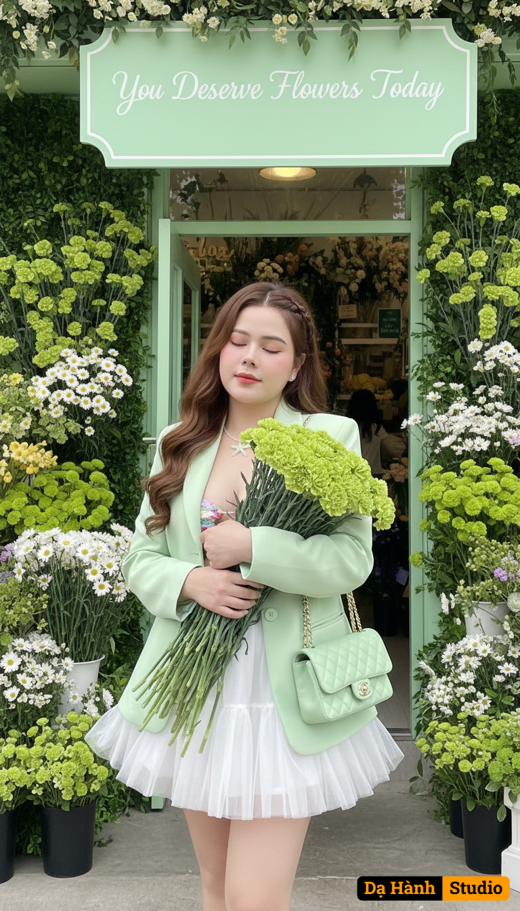

# AI Generated Image

## Details
- **Prompt:** `A hyper-realistic 8K cinematic portrait of the same woman (keep the attached face 100% identical, no modifications).
She is wearing a short white tutu dress layered with a pastel green blazer. Her hair is styled in long soft waves with a delicate braid accent. She carries a pastel green Chanel shoulder bag and holds a large bouquet of green carnations.
Pose: standing gracefully in front of the shop, holding the bouquet with both arms, eyes gently closed in a serene expression.
Scene: in front of a flower shop fully decorated with fresh green and white flowers (green carnations, daisies), with a matching green sign that reads “You Deserve Flowers Today.”
Lighting: natural soft daylight, pastel green tones, cinematic editorial photography style.
Mood: romantic, feminine, fresh, luxury magazine vibe.
Ultra-detailed, sharp focus, natural skin texture, breathtaking realism.

Negative Prompt: distorted face, changed face, blurry, painting/cartoon style, low resolution, extra fingers, oversaturated colors, text errors`
- **Category:** Nhân vật
- **Source Image:** [View Source](https://raw.githubusercontent.com/lenzcomvth/ImageLibrary/main/Female.png)

## Image
