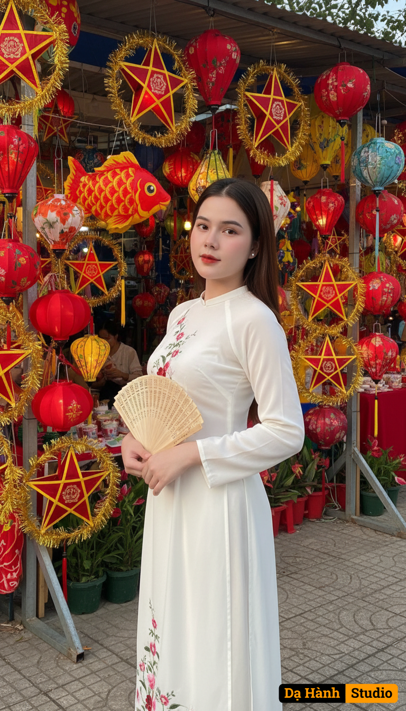

# AI Generated Image

## Details
- **Prompt:** `"A festive outdoor portrait of a young Vietnamese woman at a Mid-Autumn Festival market. She has a slim and graceful figure, with fair, luminous white skin that enhances her elegance. She wears a long flowing white áo dài with delicate floral embroidery. In her hands, she holds a traditional folding fan, positioned elegantly at her waist. Her straight dark hair is styled simply, flowing down over one shoulder, highlighting her refined look. The background is filled with colorful Mid-Autumn lanterns, including red and gold fish-shaped lanterns, star lanterns, and other festive decorations, creating a lively and joyful atmosphere. The lighting is warm golden hour sunlight, casting a soft glow on her fair skin and outfit, while enriching the vibrant colors of the lanterns. Use the exact face from the uploaded image, preserving all natural features and expression accurately.",
"style": "Cultural portrait photography, festive, realistic",
"mood": "Joyful, elegant, traditional",
"lighting": "Golden hour sunlight, warm highlights, soft shadows",
"details": {
"subject": {
"face": "Use the exact face from the uploaded image",
"skin": "Fair, luminous white skin",
"body": "Slim, graceful build",
"outfit": "White áo dài with floral embroidery",
"accessories": "Traditional folding fan",
"pose": "Standing gracefully, holding fan with both hands, gentle smile"
},
"background": "Mid-Autumn Festival market with colorful lanterns (fish-shaped, star lanterns, and others), vibrant and festive decorations"`
- **Category:** Nhân vật
- **Source Image:** [View Source](https://raw.githubusercontent.com/lenzcomvth/ImageLibrary/main/Female.png)

## Image
