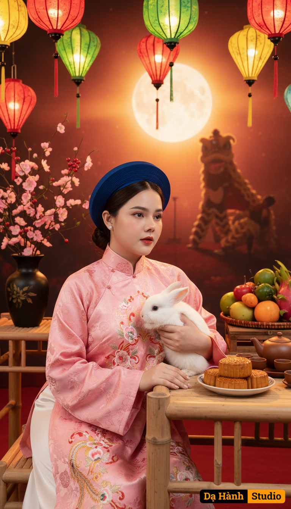

# AI Generated Image

## Details
- **Prompt:** `Keep my real face exactly the same as in the uploaded photo, do not change any facial features.
A cinematic half-body portrait during the Mid-Autumn Festival with a bright, radiant background. A beautiful young Vietnamese woman sits gracefully, leaning slightly against a bamboo table. One hand rests gently on the edge of the table, while the other cradles a real fluffy white rabbit close to her chest. Her posture is relaxed yet elegant, with her gaze softly turned into the distance, blending allure and refinement.
She wears a traditional Áo Nhật Bình in pink silk, embroidered with intricate floral and phoenix patterns. The robe has a wide rectangular collar with overlapping panels, and long flowing sleeves that convey elegance and dignity. Her makeup is soft and refined, with natural tones and red lips. Her dark brown hair is styled in a neat low bun, neatly framed by a deep royal blue circular khăn vành hat.
In front of her, the bamboo table displays golden mooncakes, a tray of colorful fruits, and a traditional brown ceramic teapot set.
In the brightly illuminated background, glowing lanterns in red, yellow, and green shine vividly, a black lacquer vase filled with peach blossoms and red berries decorates the festive setting, and the silhouette of a lion dance performance takes place under the radiant full moon. The warm, glowing atmosphere feels dreamy, celebratory, and cinematic.
Ultra-realistic 4K, half-body composition, sharp details, radiant festival lighting, bright dreamy background with rich red and golden tones.`
- **Category:** Nhân vật
- **Source Image:** [View Source](https://raw.githubusercontent.com/lenzcomvth/ImageLibrary/main/Female.png)

## Image
