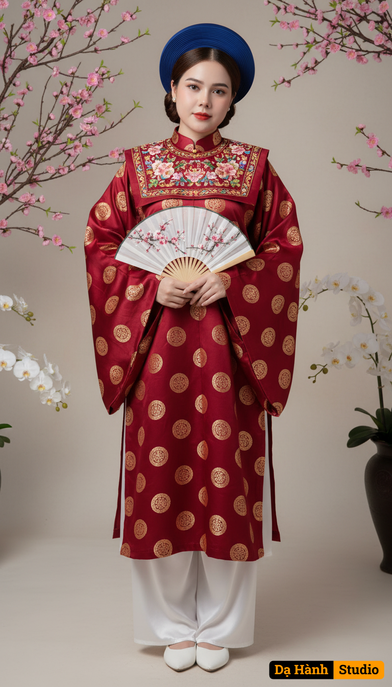

# AI Generated Image

## Details
- **Prompt:** `“Ao Nhật Bình attire in deep crimson silk, with the fabric adorned with evenly spaced golden circular patterns. The outer robe features a wide rectangular collar, with overlapping front panels forming a large rectangular block across the chest. The collar is embroidered with intricate multicolored floral and traditional motifs, creating a striking highlight at the front. The robe is wide-cut with long, flowing sleeves, evoking dignity and elegance. Inside, she wears long white silk trousers paired with simple white fabric shoes, maintaining a refined look. Use the uploaded photo to keep 100% of her original face and expression. She holds a folded white paper fan decorated with peach blossoms and white flowers. Her makeup is soft and graceful, with natural tones and red lips. On her head, she wears a deep royal blue circular khăn vành hat, neatly framing her low bun. The entire outfit conveys sophistication, solemnity, and timeless elegance, true to the traditional Áo Nhật Bình style of the past. Behind her is a classical Asian background with peach blossoms and white orchids, creating a refined and graceful atmosphere. Studio lighting, high resolution, cinematic portrait style.”`
- **Category:** Nhân vật
- **Source Image:** [View Source](https://raw.githubusercontent.com/lenzcomvth/ImageLibrary/main/Female.png)

## Image
