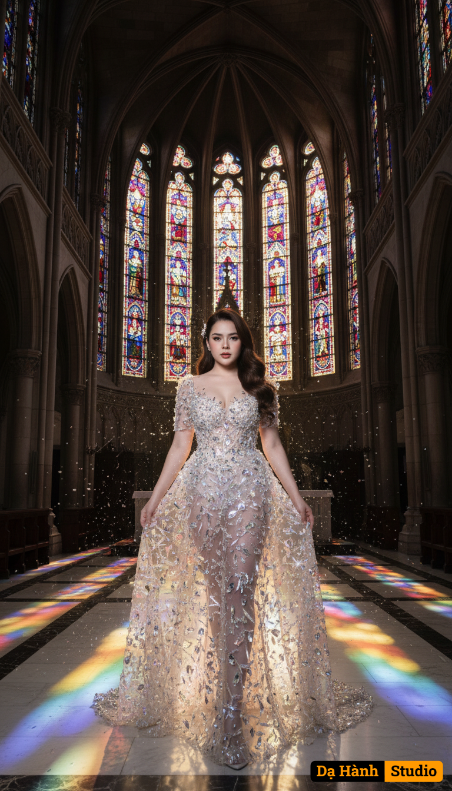

# AI Generated Image

## Details
- **Prompt:** `(Preserve the facial expression and face from the uploaded photo.)

A fine art bridal portrait titled “Crystal Cathedral.”

Setting: Inside a grand gothic cathedral, towering stone arches rise into the shadows, and magnificent stained-glass windows cast kaleidoscopic beams of red, blue, and gold light across the marble floor. The atmosphere is sacred yet dramatic, filled with a divine radiance.

Outfit: The bride wears a sheer, translucent wedding gown, exquisitely adorned with countless crystal and prism-like embellishments. The crystals shimmer like shards of broken glass catching the cathedral’s rainbow light, creating a breathtaking illusion of walking inside a cascade of light.

Styling: Long flowing hair with subtle waves, makeup luminous yet sharp, with crystal-like highlights on her cheekbones to echo the gown’s sparkle.

Pose: She steps forward gracefully, one hand brushing lightly against the hem of her gown, the other relaxed at her side. Her gaze is fixed directly at the camera — confident, ethereal, and commanding — as if she is both a bride and a goddess of light.

Atmosphere: Surreal, reverent, and cinematic. The stained-glass glow and crystalline gown merge into a dazzling harmony of color, light, and reflection, blending bridal couture with gothic majesty.

Style: Ultra realistic, high-detail editorial fashion photography. Dramatic lighting, vivid stained-glass reflections, moody gothic ambience, infused with divine elegance. `
- **Category:** Nhân vật
- **Source Image:** [View Source](https://raw.githubusercontent.com/lenzcomvth/ImageLibrary/main/Female.png)

## Image
