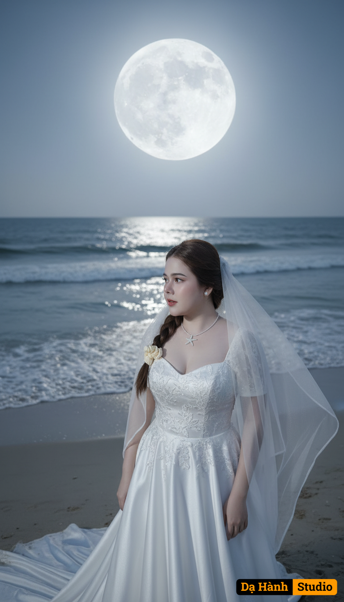

# AI Generated Image

## Details
- **Prompt:** `A fine art bridal scene titled “Moonlight Romance.”

Background: A serene night beach with gentle waves glistening under the light of a massive full moon. The moon hangs low, casting a silver glow across the water and illuminating the sand with a dreamy shimmer.

Outfit: The bride wears a flowing satin wedding gown in silvery white, its long train trailing behind her. A sheer bridal veil billows in the ocean breeze, glowing softly in the moonlight.

A fine art bridal portrait titled “Moonlight Romance.”

Background: A dreamy night beach with the full moon glowing brightly above the ocean, its silver light reflecting softly on the water. The scene is bathed in ethereal moonlight, with a gentle ocean breeze.

Outfit: The bride wears a satin wedding gown in silvery white with delicate details, paired with a sheer bridal veil flowing around her shoulders.

Pose: Captured in a close-up portrait, she gazes softly to the side, her face illuminated by moonlight. The veil flutters gently, framing her face like a halo. Her expression is serene, romantic, and timeless.

Atmosphere: Ethereal, poetic, and cinematic. The moonlight highlights her features, creating a luminous glow that enhances her elegance and grace.

Style: Ultra realistic, cinematic lighting, high detail, fine art editorial portrait photography with dreamy tones. `
- **Category:** Nhân vật
- **Source Image:** [View Source](https://raw.githubusercontent.com/lenzcomvth/ImageLibrary/main/Female.png)

## Image
