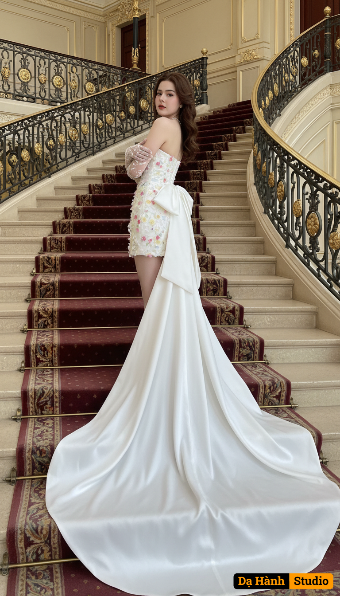

# AI Generated Image

## Details
- **Prompt:** `A tall and slender young bride, keeping the same face from the uploaded image, stands on a grand royal-style staircase designed with classical elegance, ornate railings, and luxurious details that evoke opulence and nobility. She wears a short, strapless white wedding dress above the knee, fitted and decorated with delicate 3D floral motifs on the bodice and skirt. At the back, a large bow made of smooth fabric is attached, extending into a long, flowing train that cascades dramatically down the staircase. She gently crosses her arms in front of her chest, wearing thin tulle gloves decorated with tiny flowers. Her hair is styled in soft loose curls, and her makeup is natural with light red lips. She is captured in motion, gracefully stepping on the stairs while turning her head back with elegance, her long trailing gown spread beautifully across the royal staircase. The lighting softly enhances her slender figure, delicate floral bodice, and the grandeur of the flowing train, creating a scene of luxury and timeless beauty. `
- **Category:** Nhân vật
- **Source Image:** [View Source](https://raw.githubusercontent.com/lenzcomvth/ImageLibrary/main/Female.png)

## Image
