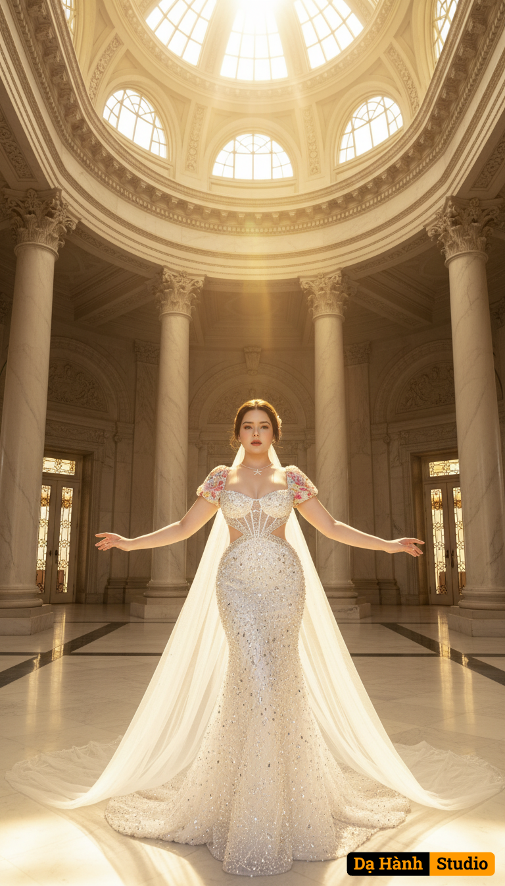

# AI Generated Image

## Details
- **Prompt:** `(Preserve the facial expression and face from the uploaded photo.)

A breathtaking bridal portrait set inside a grand marble palace. The vast hall is adorned with towering white marble columns, polished stone floors, and golden sunlight streaming down through the domed ceiling, casting a divine glow across the scene.

The bride wears a bold cut-out wedding gown, encrusted with sparkling crystals that cascade like radiant beams of light. The fabric shimmers with every reflection, creating a celestial, goddess-like aura.

Pose: She stands gracefully in the center of the marble hall, arms outstretched wide, head tilted slightly upward with confidence and elegance — embodying the spirit of a Greek goddess. Her long veil flows dramatically behind her, catching the golden light.

Atmosphere: Majestic, ethereal, and divine. The fusion of architectural grandeur and radiant bridal fashion creates a sense of timeless elegance and powerful femininity.

Style: Ultra realistic, high-fashion editorial photography. Cinematic golden lighting, dramatic composition, with fine art details capturing both the marble textures and the dazzling crystal reflections. `
- **Category:** Nhân vật
- **Source Image:** [View Source](https://raw.githubusercontent.com/lenzcomvth/ImageLibrary/main/Female.png)

## Image
