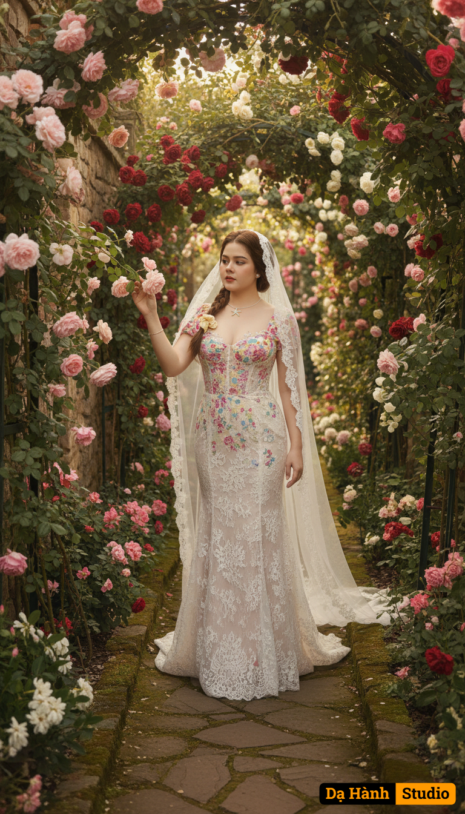

# AI Generated Image

## Details
- **Prompt:** `A fine art bridal portrait titled “Bridal in Secret Garden.”

Background: An enchanting secret garden filled with lush greenery and blooming climbing roses in shades of pink, red, and white. Sunlight filters softly through the canopy of leaves, casting dappled golden light on the garden path. The atmosphere is dreamy, intimate, and timeless.

Outfit: The bride wears a vintage-inspired lace wedding gown with intricate floral embroidery and a floor-length silhouette. A long, delicate veil drapes over her hair and trails behind her, adding softness and romance.

Pose: She walks gracefully along a narrow garden path, her hand gently brushing against the petals of climbing roses as if lost in the garden’s magic. Her expression is serene and poetic, embodying a sense of wonder.

Atmosphere: Romantic, nostalgic, and ethereal, with an emphasis on natural beauty and quiet elegance. Gentle sun rays highlight the lace details and veil, creating a painterly, almost fairytale-like composition.

Style: Ultra realistic, cinematic lighting, fine art editorial photography aesthetic, rich in texture and color, infused with the elegance of vintage romance. `
- **Category:** Nhân vật
- **Source Image:** [View Source](https://raw.githubusercontent.com/lenzcomvth/ImageLibrary/main/Female.png)

## Image
