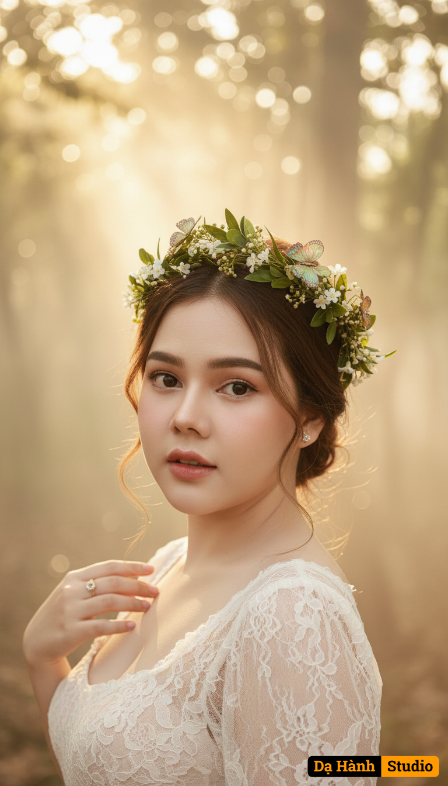

# AI Generated Image

## Details
- **Prompt:** `(Preserve the facial expression and face from the uploaded photo.)

A fine art bridal portrait titled “Fairy Forest Bride.”

Framing: Cinematic close-up portrait, focusing on the bride’s face, upper body, and delicate details of her attire and accessories.

Background: A mystical forest shrouded in soft mist. Shafts of golden sunlight filter through leaves behind her, blurred into a dreamy bokeh effect, creating a magical and ethereal backdrop.

Outfit & Styling: The bride wears a delicate sheer lace gown visible at the neckline and shoulders. Her head is crowned with a wreath of intertwined green leaves and sparkling butterflies, enhancing her fairy-like elegance.

Pose: She gazes softly at the camera, barefoot serenity implied, her expression tender and enchanting. Her hand gently touches the wreath or her gown’s lace strap, adding intimacy to the portrait.

Atmosphere: Dreamy, poetic, and ethereal. Mist and warm light glow around her silhouette, suggesting she is a mystical forest fairy bride.

Style: Ultra realistic, cinematic lighting, high detail, fine art editorial photography with fantasy and fairytale aesthetics. `
- **Category:** Nhân vật
- **Source Image:** [View Source](https://raw.githubusercontent.com/lenzcomvth/ImageLibrary/main/Female.png)

## Image
