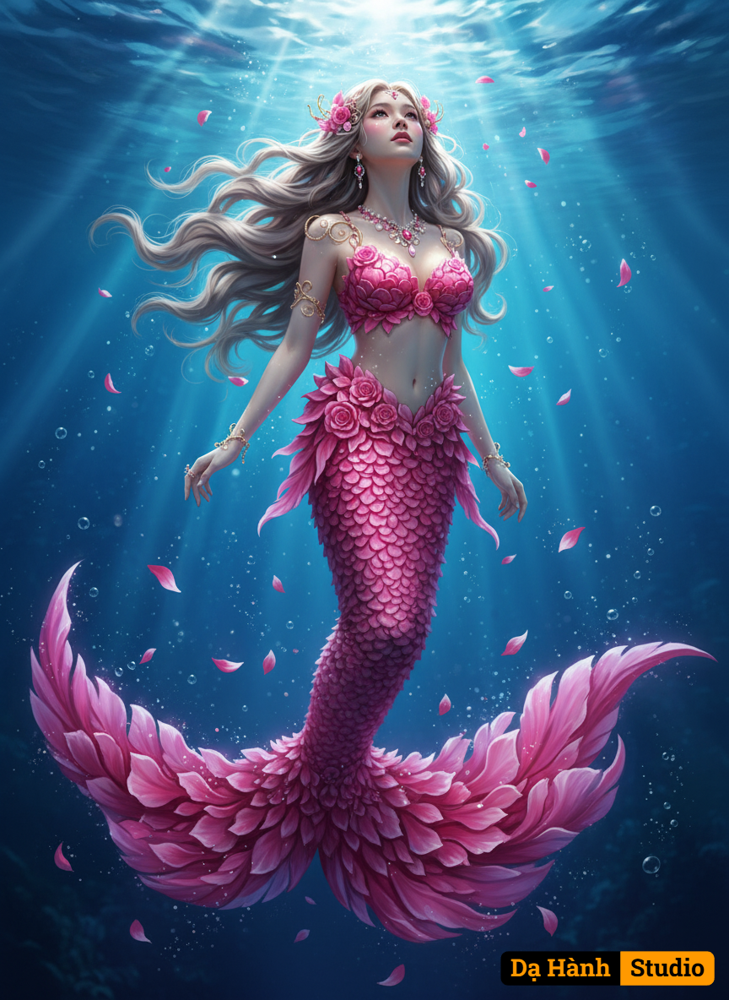

# AI Generated Image

## Details
- **Prompt:** `สร้างภาพผู้หญิงต้นฉบับ (อ้างอิงหน้าตา หูจมูกปาก บุคคลจากภาพ 100% )
สร้างภาพถ่ายสมจริงและมีรายละเอียดสูงของนางเงือกที่งดงาม ผมสีบลอนด์เทาลอนยาวสลวยปลิวไสว ว่ายน้ำอย่างสง่างามในน้ำทะเลสีฟ้าเข้มลึกลับแต่สดใส หางของเธอประกอบด้วยกลีบดอกไม้สีชมพูที่ซ้อนกันอย่างประณีต คล้ายกับดอกกุหลาบ มีกลีบดอกไม้สีชมพูลอยอยู่รอบๆ ตามรายละเอียดดังนี้
ส่วนบน (ลำตัว/เสื้อท่อนบน):
ลักษณะ: คล้ายกับบรา ที่ไม่ได้มีการตัดเย็บแบบผ้า แต่ถูกสร้างขึ้นจากกลีบดอกไม้สีชมพู
รายละเอียด: กลีบดอกไม้จะจัดเรียงตัวซ้อนกันอย่างหนาแน่นและประณีต โอบรับส่วนหน้าอกและลำตัว
การเชื่อมต่อ: กลีบดอกไม้เหล่านี้จะค่อยๆ ไล่ระดับความหนาแน่นและเรียวบางลง เมื่อลงไปถึงช่วงเอวและสะโพก เพื่อเชื่อมต่อกับส่วนหาง

2. ส่วนหาง (หางปลา/กระโปรง):
วัสดุหลัก: หางทั้งหมดถูกออกแบบให้ดูราวกับทำมาจากกลีบดอกไม้สีชมพูจำนวนมหาศาล
เกล็ด: ไม่ได้เป็นเกล็ดปลาทั่วไป แต่เป็นกลีบดอกไม้ขนาดเล็กที่ซ้อนทับกันเป็นชั้นๆ ตลอดทั้งความยาวของหาง ทำให้เกิดพื้นผิวที่มีมิติและอ่อนช้อย (คล้ายกับกลีบของดอกกุหลาบ)
ความพลิ้วไหว: กลีบดอกไม้เหล่านี้ให้ความรู้สึกนุ่มนวลและพริ้วไหวในน้ำ (Flouncy and flowing)
ครีบหาง (Fin): ส่วนปลายสุดของหางมีลักษณะเป็นครีบขนาดใหญ่ (Fin) ที่แผ่กว้างออกไปอย่างอลังการ โดยยังคงรักษารูปแบบที่เป็นกลีบดอกไม้สีชมพูมหึมาที่กำลังบานอยู่ใต้ทะเล ชุดนางเงือกนี้มีธีมเป็น "ราชินีกุหลาบใต้สมุทร" ที่ใช้สีชมพูสดเป็นหลัก

เธอสวมเครื่องประดับ สร้อยคอ ต่างหู และเครื่องประดับผมที่เข้ากันกับชุด
แสงไฟน่าทึ่ง มีแสงส่องลงมาจากผิวน้ำ คุณภาพสูงพิเศษ, แสงแบบภาพยนตร์, น่าทึ่ง.
นางเงือก, ใต้ทะเล, ฟางกลีบดอกไม้สีชมพู, เหล็กกลีบกุหลาบสีชมพู, ผมลอนยาวสีบลอนด์เทาพลิ้วไหว, เงยหน้ามองแสง, แสงแบบภาพยนตร์, แฟนตาซี, มีรายละเอียดสูงมาก, โดยศิลปินเช่น Artgerm และ WLOP, 8k.
ภาพถ่ายแฟนตาซีของนางเงือกที่มีผมสีบลอนด์เทา และหางที่ทำจากกลีบดอกไม้สีชมพูที่ลดหลั่นลงมา เธอแขวนอยู่ในความลึกของน้ำสีฟ้าเข้มสดใส โดยมีแสงแดดส่องลงมาอย่างสว่างไสว อารมณ์ความรู้สึก, ดูเหนือธรรมชาติ, ท่าทางที่น่าทึ่ง

ข้อความเชิงลบ (ต้องห้าม):
ภาพวาดสีน้ำมัน ภาพวาดลายเส้น ภาพวาดการ์ตูน ภาพวาดอนิเมะ วาดแบบ 3 มิติการ์ตูน อะนิเมะ ภาพประกอบ ผิวพลาสติก ลักษณะคล้ายตุ๊กตา กายวิภาควิภาคบิดเบือน`
- **Category:** Nhân vật
- **Source Images:**
  - [View Source](https://raw.githubusercontent.com/lenzcomvth/Somethings/main/Models/Female/Female3.jpg)

## Image
