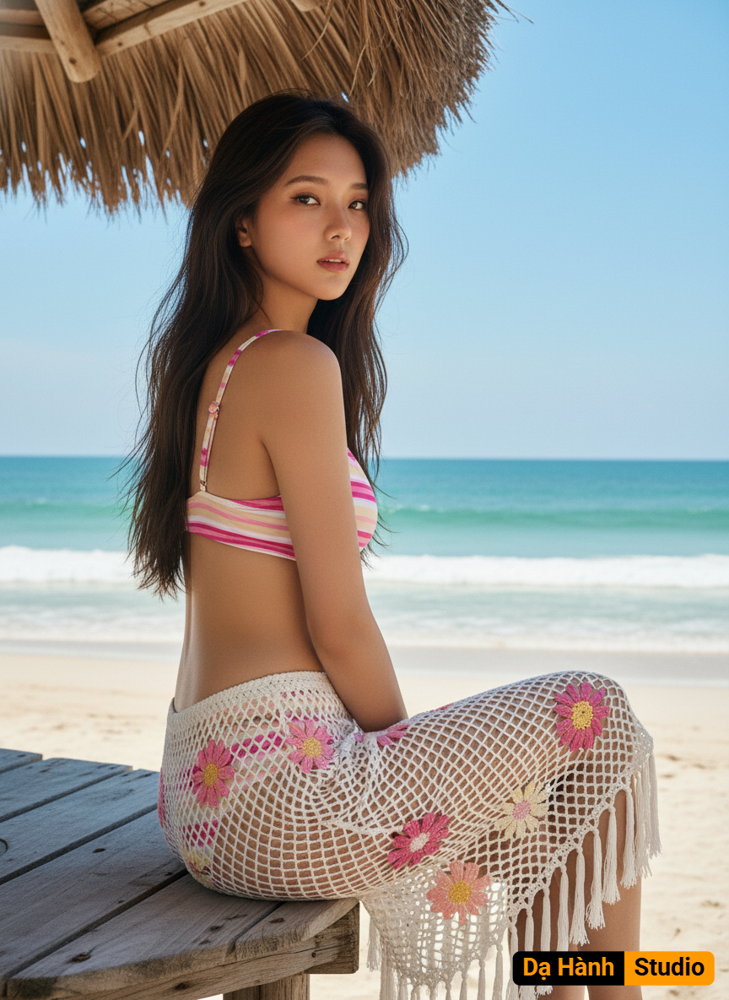

# AI Generated Image

## Details
- **Prompt:** `Crea una foto sin cambiar los rasgos faciales. La imagen muestra a una mujer joven sentada de perfil en una estructura de madera rústica, mirando ligeramente por encima del hombro hacia la cámara.
Entorno: Está en una playa azul turquesa, arenosa bajo un cielo azul despejado y soleado. Se ve el océano azul turquesa en el fondo con una línea de olas rompiendo cerca de la orilla. Una parte de un techo o parasol de paja rústico es visible en la esquina superior izquierda, proporcionando algo de sombra.
Atuendo y Accesorios:
• Lleva un bikini (la parte superior es visible) con un patrón colorido, posiblemente a rayas en tonos rosa palo y fiusha y blancos.
• Lo más llamativo es su pareo o falda de crochet de malla en color blanco. El tejido es una red abierta y está decorado con apliques de soles y flores en tonos rosa y amarillo, y borlas blancas colgantes.
Pose y Apariencia:
• La mujer tiene el pelo largo, lacio al color de la imagen que cae sobre sus hombros.
• Su pose es segura y a la moda, con el cuerpo ligeramente girado, haciendo contacto visual sobre el hombro.
• La iluminación es natural y brillante, típica de un día soleado en la playa.
En resumen, la foto captura un momento de moda playera con un estilo bohemio y artesanal muy marcado, combinando texturas rústicas con un paisaje costero hermoso.`
- **Category:** Nhân vật
- **Source Images:**
  - [View Source](https://raw.githubusercontent.com/lenzcomvth/Somethings/main/Models/Female/Female3.jpg)

## Image
