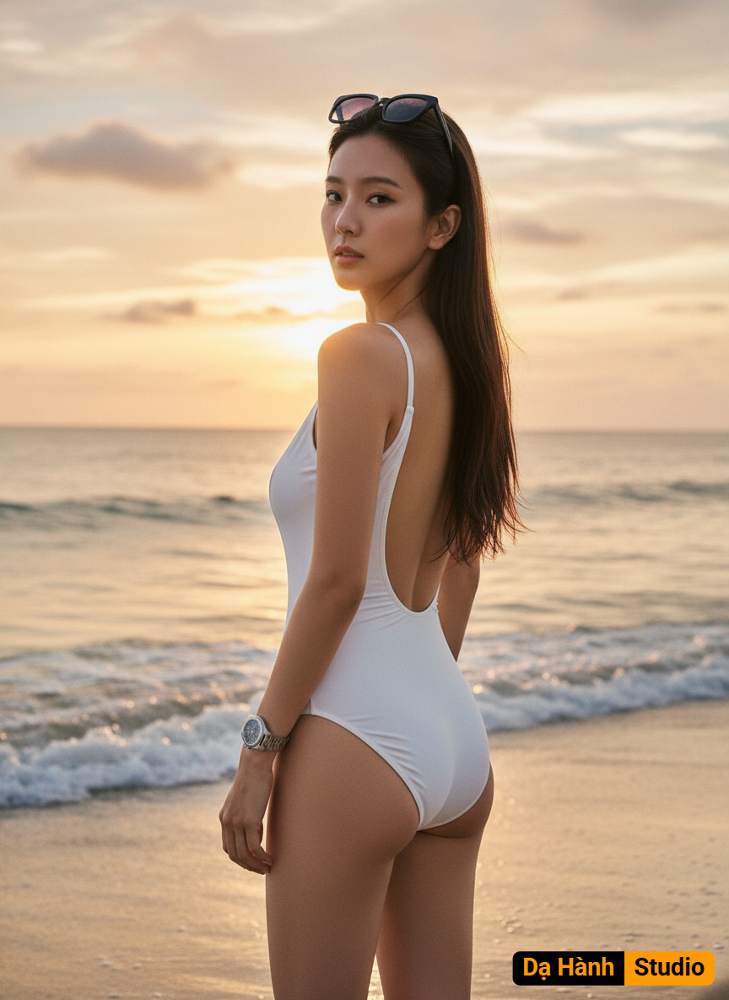

# AI Generated Image

## Details
- **Prompt:** `Crea una fotografía sin cambiar mis rasgos faciales
Esta es una fotografía de una mujer de pie en la orilla del mar al atardecer o amanecer.
​Sujeto y Vestimenta:
La mujer, de cabello al color de la imagen lacio y largo, está de espaldas, girando la cabeza para mirar a la cámara. Lleva puesto un traje de baño blanco de una sola pieza, con la espalda baja. En la cabeza, lleva unos lentes de sol negros trasparentes elegantes. En la muñeca izquierda, lleva un reloj de pulsera grande.
​Fondo y Ambiente:
El fondo está dominado por la playa y el océano. Se pueden ver pequeñas olas rompiendo suavemente en la arena mojada. La luz es suave y cálida, lo que sugiere el momento de la hora dorada. El cielo está lleno de nubes tenues que se tiñen de tonos anaranjados, amarillos y rosas por el sol bajo, creando un ambiente muy atmosférico y cálido.
​Composición y Estilo:
La toma es un plano medio o plano americano, con la mujer ocupando el centro de la composición. La pose es dinámica y sensual, mirando por encima del hombro. La iluminación natural y los colores cálidos contribuyen a un estilo que podría ser de fotografía de moda, lifestyle o de viaje. En la pompa en una parte de arriba en la esquina tiene un Crea una fotografía sin cambiar mis rasgos faciales
Esta es una fotografía de una mujer de pie en la orilla del mar al atardecer o amanecer.
​Sujeto y Vestimenta:
La mujer, de cabello al color de la imagen lacio y largo, está de espaldas, girando la cabeza para mirar a la cámara. Lleva puesto un traje de baño blanco de una sola pieza, con la espalda baja. En la cabeza, lleva unos lentes de sol negros trasparentes elegantes. En la muñeca izquierda, lleva un reloj de pulsera grande.
​Fondo y Ambiente:
El fondo está dominado por la playa y el océano. Se pueden ver pequeñas olas rompiendo suavemente en la arena mojada. La luz es suave y cálida, lo que sugiere el momento de la hora dorada. El cielo está lleno de nubes tenues que se tiñen de tonos anaranjados, amarillos y rosas por el sol bajo, creando un ambiente muy atmosférico y cálido.
​Composición y Estilo:
La toma es un plano medio o plano americano, con la mujer ocupando el centro de la composición. La pose es dinámica y sensual, mirando por encima del hombro. La iluminación natural y los colores cálidos contribuyen a un estilo que podría ser de fotografía de moda, lifestyle o de viaje.`
- **Category:** Nhân vật
- **Source Images:**
  - [View Source](https://raw.githubusercontent.com/lenzcomvth/Somethings/main/Models/Female/Female3.jpg)

## Image
