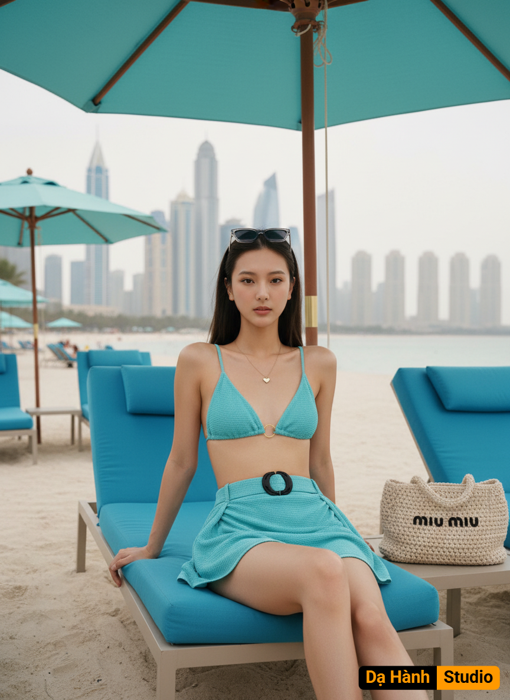

# AI Generated Image

## Details
- **Prompt:** `Crea una foto sin cambiar los rasgos faciales. La imagen muestra a una mujer joven sentada en una tumbona azul bajo una sombrilla en lo que parece ser una playa o resort. Está vestida a la moda con un conjunto de dos piezas en un tono azul aqua brillante con textura.
Descripción del Atuendo y Accesorios
• Lleva un bikini de triángulo con un aro dorado central.
• La parte de abajo es una mini falda drapeada o fruncida con un gran cinturón o hebilla negra en forma de C en la cadera.
• En la cabeza, lleva unos lentes de sol negros trasparentes muy elegantes
• A su lado, sobre la tumbona, hay un bolso de rafia o crochet de color beige o marrón claro con el logo de Miu Miu bordado en un color oscuro.
• Lleva un collar sencillo con un pequeño dije en forma de corazón
Fondo y Ambiente
• El ambiente es de lujo y vacaciones.
• El fondo inmediato es una playa de arena clara, con otras tumbonas azules y sombrillas de color azul Aqua
a juego.
• Detrás de la playa, se puede ver un impresionante horizonte de rascacielos modernos, sugiriendo una ubicación en una gran ciudad costera como Dubái
(dado el estilo de los edificios). • El cielo es ligeramente nublado o brumoso, pero la luz es suficiente para una foto de día.
• En general, la foto captura un momento de estilo veraniego chic y glamuroso.
No cambies rostro, ni rasgos físicos, el cabello largo lacio del mismo color a la imagen.`
- **Category:** Nhân vật
- **Source Images:**
  - [View Source](https://raw.githubusercontent.com/lenzcomvth/Somethings/main/Models/Female/Female3.jpg)

## Image
