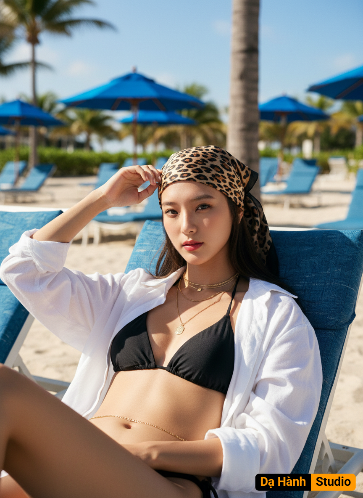

# AI Generated Image

## Details
- **Prompt:** `: Crea una foto sin cambiar los rasgos faciales La foto muestra a una joven mujer disfrutando de un día soleado en la playa, sentada y reclinada en una tumbona o silla de playa con cojines azules.
• Atuendo y Accesorios: Viste un bikini negro de triángulo. Lleva una camisa blanca, holgada y desabrochada sobre el bikini, que le da un toque casual y la protege del sol. Un accesorio llamativo es el pañuelo con estampado de leopardo que lleva atado en la cabeza. Además, se aprecian un par de collares y una delicada cadena dorada alrededor de su cintura. Su maquillaje es sutil pero resalta sus labios con un tono rojizo intenso.
• Postura y Ambiente: La mujer tiene una pose relajada, con la mano derecha ligeramente levantada tocando su sien. Mira fijamente hacia la cámara con una expresión calmada. El fondo revela un entorno playero típico, con sombrillas azules y otras tumbonas blancas, indicando que se encuentra en un área de descanso. Se ven palmeras y una zona de arena clara bajo un cielo azul brillante. La luz del sol es intensa, creando un ambiente veraniego y vacacional.
En resumen, la imagen captura un momento de relajación y estilo en un día de playa. Su cabello es lacio largo al color de la imagen`
- **Category:** Nhân vật
- **Source Images:**
  - [View Source](https://raw.githubusercontent.com/lenzcomvth/Somethings/main/Models/Female/Female3.jpg)

## Image
