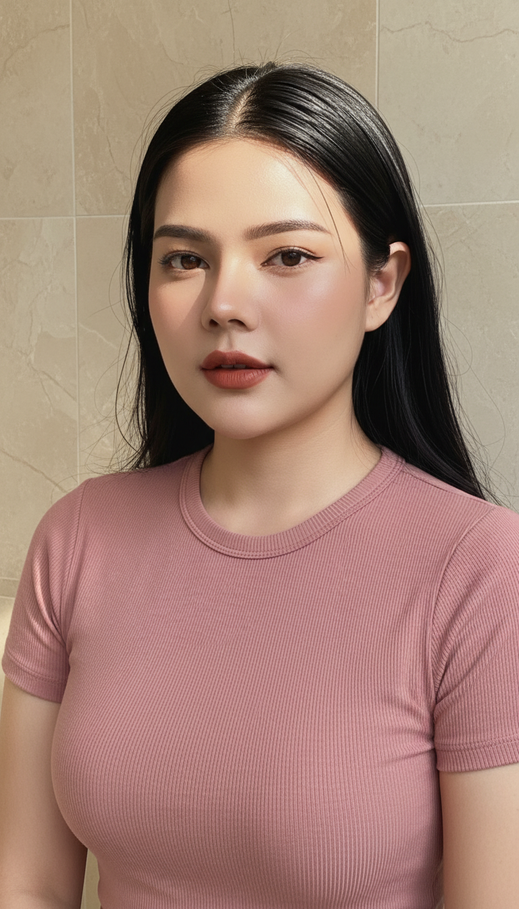

# AI Generated Image

## Details
- **Prompt:** `Ultra-photorealistic cinematic portrait, 8K sharpness, vertical 9:16, high detail, natural skin texture. Preserve the exact face identity from the uploaded reference photo — 100% locked facial structure. A beautiful East Asian woman, in her early 20s, with a gentle, neutral expression and a direct gaze. She has a symmetrical face, high cheekbones, a defined jawline, and full lips. Her long, straight, black hair, appearing slightly wet or shiny, is parted slightly to the side, with some strands falling over her shoulders and intricate hair details visible. She wears subtle brown winged eyeliner, minimal eyeshadow, neatly shaped eyebrows, and matte terracotta red lipstick. She is wearing a fitted, short-sleeved top in a dusty rose or terracotta red color, featuring a subtle vertical ribbed texture. None. The woman is positioned in a corner against light beige or cream-colored tiled walls with subtle marble-like patterns and visible grout lines. The background is slightly soft but still detailed enough to show the textures of the tiles. The composition is a close-up portrait, focusing on her face and upper body. Strong, natural direct sunlight from an overhead or side source creates bright highlights on her forehead and hair, forming a distinct elongated glow on her head. The lighting is warm, casting subtle shadows that define her features and hair strands. High-fashion editorial portrait, natural light photography, clean aesthetic, vibrant colors, stunning detail.`
- **Category:** Nhân vật
- **Source Image:** [View Source](https://raw.githubusercontent.com/lenzcomvth/ImageLibrary/main/Female.png)

## Image
