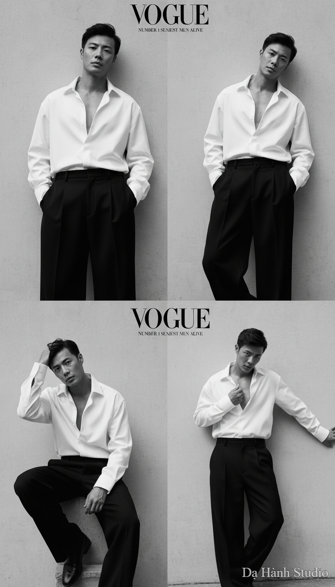

# AI Generated Image

## Details
- **Prompt:** `A hyper-realistic black and white high-fashion editorial portrait of the user (KEEP FACE FEATURES ORIGINAL, hairstyle, and body proportions exactly). He is wearing an oversized white dress shirt, unbuttoned halfway to reveal his chest, paired with wide-leg black trousers in a relaxed fit. The fabric flows elegantly, giving a sensual yet luxurious vibe. His pose is confident and slightly provocative: leaning back against a minimalist wall, one hand casually in his pocket while the other grazes his collar. Put the title of the magazine VOGUE at the top of the picture together with a caption of number 1 Sexiest men alive. Provide five different shots and postures for the photo, maintaining the VOGUE cover style: The lighting is dramatic and moody, with high contrast — deep shadows carve out his jawline and cheekbones, while soft highlights trace the folds of the oversized shirt. The atmosphere is sexy, mysterious, and fashion-forward, like a cover photo for a luxury magazine campaign. Shot in 8K Leica-style monochrome, with sharp textures, cinematic depth, subtle grain, and a timeless noir aesthetic. The mood: seductive, bold, and effortlessly stylish.`
- **Category:** Nhân vật
- **Source Image:** [View Source](https://raw.githubusercontent.com/lenzcomvth/ImageLibrary/main/Male.png)

## Image
