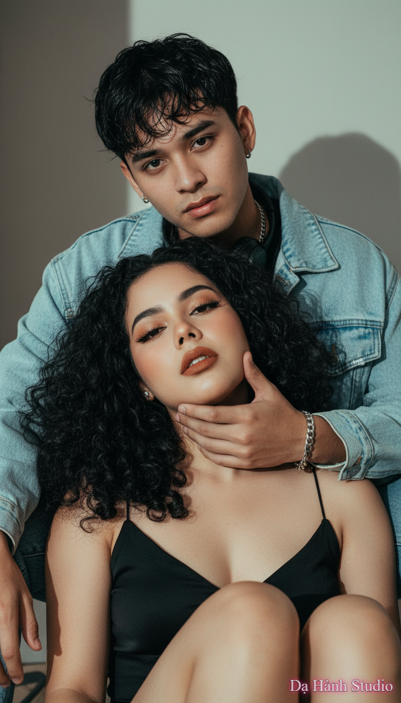

# AI Generated Image

## Details
- **Prompt:** `preserve face / identity locked — preserve BOTH faces exactly from the uploaded photo, do NOT alter facial structure, proportions, expression, hairline, brows, or lip shape. NO UI overlays/watermarks.

Ultra-photorealistic editorial couple portrait — 1:1 recreation of the provided reference. Vertical aspect ratio matching original (approx 9:19). Frame: full-body-to-mid-thigh with both heads centered as in reference.

Camera: focal length ≈ 50mm (FF), aperture f/3.2–f/4, distance ~1.4–2.0m, camera slightly tilted downward (~5–12°) relative to subjects (to match original framing).

Exact subject poses (copy 1:1):
- MALE (behind, slightly higher): seated/raised; torso leaning forward. LEFT arm wraps around female's lower jaw/neck area — thumb resting near female's left cheekbone, fingers curling under her chin; visible silver chain-bracelet on his wrist. Right arm relaxed. Head yaw slightly turned (~+10° to his right), chin mildly raised. Gaze: slightly off-center (not straight at camera), detached.
- FEMALE (foreground, lower): seated, leaning back into male; head tilted back (chin slightly lifted) and rotated almost straight to camera. Eyes: half-open (sleepy/sultry), gaze directed at camera with a slight upward vector (~5° up). Mouth: lips slightly parted (~2–4 mm), strong cupid's bow, lower lip fuller. Expression: sultry / detached, not smiling.

Face & facial-detail constraints (MANDATORY):
- Keep EXACT proportions of both faces: eye spacing, nose width, mouth shape, jawline angles. Do not thin/widen lips or change eyebrow shape.
- Keep female eye make-up: dark upper eyeliner, smoky under-eye smudge, heavy lashes. Keep lip color: warm brick/terracotta matte. Preserve skin texture (pores), subtle highlights on cheekbones and nose.

Hair (exact):
- Male: textured, slightly wet-look fringe; strands fall over forehead.
- Female: BLACK, very full, dense ringlet curls / textured waves, center-to-slightly-offset part, many tendrils falling across forehead and cheeks. High volume—do not replace with straight hair.

Clothing & props (exact):
- Male: light-blue oversized denim jacket (visible seam detail), black crew-neck shirt, thin silver chain necklace, headphones around neck visible.
- Female: black slip/tank top (thin straps), matte fabric; bare legs visible in lower frame.
- Bracelet: male wrist chain visible where hand cups female jaw.

Lighting & color (match reference):
- Key: large softbox camera-left/front (~30–45°) slightly above head creating soft directional shadows on right side of faces.
- Fill: light reflector front-right to reduce but not remove shadows (key:fill ≈ 3:1).
- Rim: subtle back-right hair light to separate curls.
- Grade: cinematic — warm skin highlights, cool/teal shadows; slightly desaturated midtones, lift blacks a bit; subtle vignette and light film grain.
- Keep visible shadow cast on background consistent with short subject-to-wall distance.

Post-processing:
- Retouch minimal: remove major blemishes but preserve pores, sharpen eyes & hair, enhance denim texture. Keep natural texture of lips and eyelashes. Do NOT alter facial geometry.

Output: photorealistic, editorial magazine quality, high resolution (4k+). Strict: preserve identity of both faces EXACTLY from upload.
`
- **Category:** Nhân vật
- **Source Image:** [View Source](https://raw.githubusercontent.com/lenzcomvth/ImageLibrary/main/Female.png)

## Image
