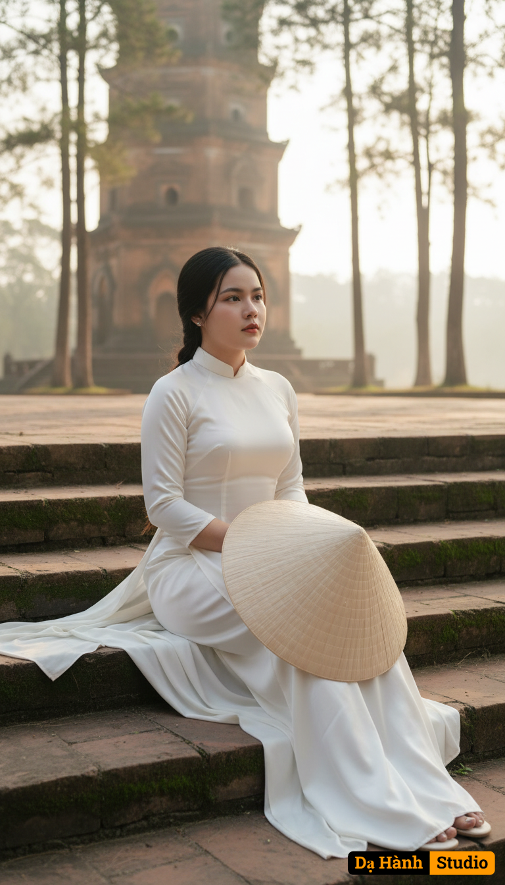

# AI Generated Image

## Details
- **Prompt:** `Reproduce based on the uploaded reference photo, keeping the real face, hair, natural feeling, and exact proportions from the reference. A charming Vietnamese girl is wearing a traditional white silk Ao Dai, gently placing a conical hat on her lap. Her natural black hair and light makeup exude the poetic beauty of a Hue girl. She sits gracefully on the ancient mossy stone steps in front of Phuoc Duyen Tower at Thien Mu Pagoda, shown in a full-body posture with a graceful appearance. Her head is slightly tilted with a dreamy, calm facial expression, eyes gazing far away.

The scene is captured in a wide-angle cinematic frame with a 2:3 vertical ratio, following the rule of thirds: the subject positioned in the left third of the frame. Foreground shows mossy stone steps, while the background reveals Phuoc Duyen Tower with its charming ancient brick walls, pine trees, and a delicate view of the Perfume River. The composition balances the character with the architectural and natural context, creating depth and atmosphere.

Lighting is gentle golden sunlight of early morning, naturally diffused through pine needles, creating soft highlights on the Ao Dai fabric and natural shadows, evoking a spiritual, romantic, and dreamy Hue atmosphere.

Technical style: ultra-realistic 8K resolution with cinematic quality. Shallow depth of field (f/2.0–f/2.8) with soft natural bokeh. Realistic textures of rocks, silk, and leaves. Natural pastel tones and high detail, delivering a film-like aesthetic.

Output: a high-quality full-body portrait in 2:3 vertical ratio, presenting a dreamy, cultural, and poetic image of a Hue young woman at Thien Mu Pagoda, seated on ancient steps in an elegant and balanced cinematic composition.`
- **Category:** Nhân vật
- **Source Image:** [View Source](https://raw.githubusercontent.com/lenzcomvth/ImageLibrary/main/Female.png)

## Image
