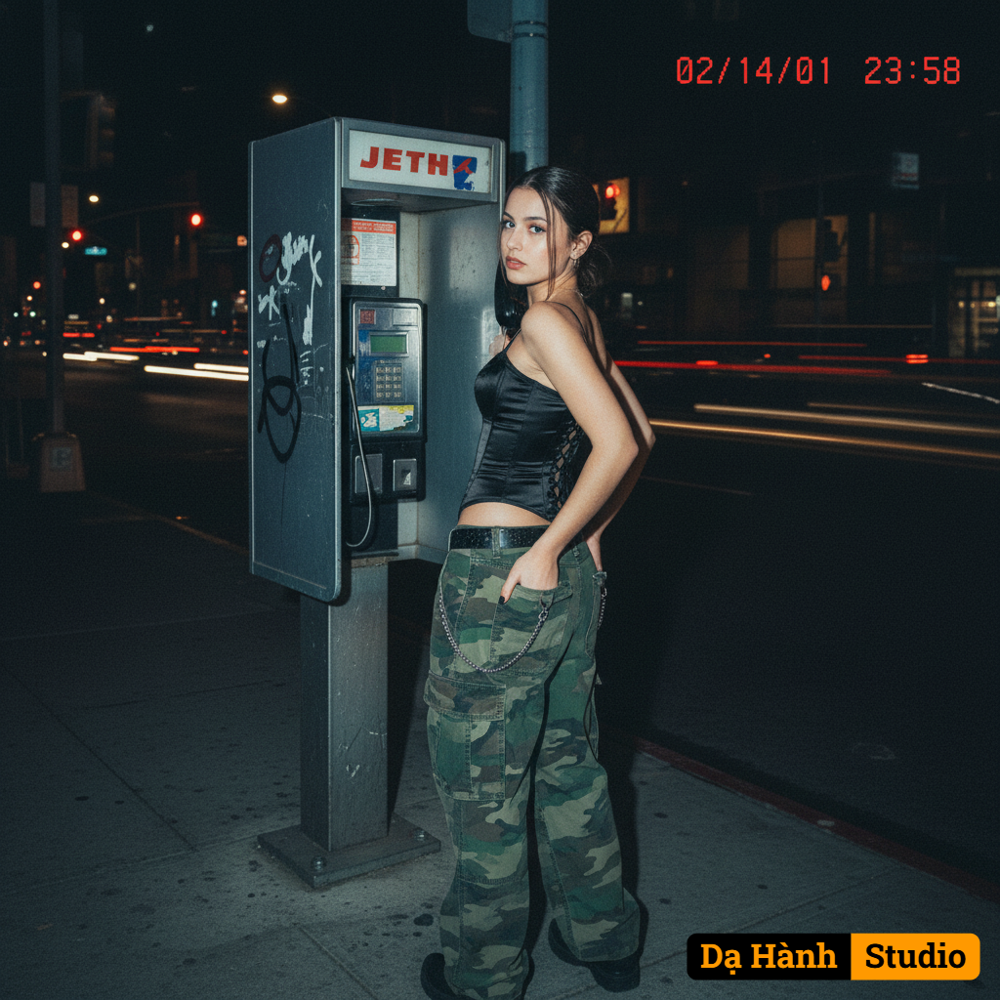

# AI Generated Image

## Details
- **Prompt:** `A FLASH-LIT DIGITAL PHOTO CAPTURED AT NIGHT WITH A VINTAGE Y2K AESTHETIC, TIMESTAMP GLOWING RED IN THE POWER CORNER, A YOUNG WOMAN STANDS AT A PUBLIC PAYPHONE, HER BODY TURNED AWAY BUT HER FACE GLANCING BACK TOWARD THE LENS WITH A COOL, DETACHED EXPRESSION, SHE WEARS A TIGHTLY LACED CORSET TOP AND LOOSE-FITTING CARGO JEANS, HER HANDS TUCKED INTO THE BACK POCKETS IN A RELAXED, SELF-ASSURED STANCE, THE AMBIENT LIGHTING CASTS LONG SHADOWS ACROSS THE SIDEWALK, WHILE TRAFFIC LIGHTS ANDPASSING CAR HEADLIGHTS BLUR IN THE DISTANT BACKGROUND, THE SATURATED FLASH FLATTENS THE FOREGROUND AND INTENSIFIES THE CONTRAST, LENDING THE IMAGE A RAW, CANDID ENERGY REMINISCENT OF EARLY-2000S PAPARAZZI SHOTS, URBAN AND NOSTALGIC, THE SCENE CAPTURES THE INTERSECTION OF REBELLION, FEMININITY, AND A DISTINCTLY ANALOG KIND OF INTIMACY.`
- **Category:** Nhân vật
- **Source Image:** [View Source](https://raw.githubusercontent.com/lenzcomvth/ImageLibrary/main/Female.png)

## Image
