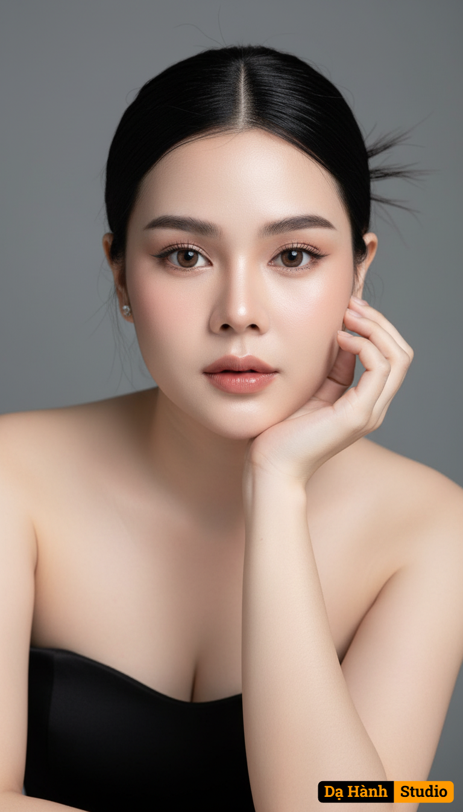

# AI Generated Image

## Details
- **Prompt:** `Use the uploaded reference image as the basis for the face and preserve the exact facial structure, proportions, and natural features without alteration. Generate a photorealistic editorial beauty portrait of a beautiful young woman with porcelain skin and large, doll-like eyes, posing elegantly against a plain gray studio background. She has sleek black hair neatly tied back, with a few strands framing her face. She wears a simple strapless black dress that emphasizes her graceful shoulders and neckline. She gently rests her face on one hand, giving a refined and ethereal expression. Capture the scene in soft studio lighting, sharp focus, highly detailed, flawless skin, elegant and minimal aesthetic, masterpiece quality.`
- **Category:** Nhân vật
- **Source Image:** [View Source](https://raw.githubusercontent.com/lenzcomvth/ImageLibrary/main/Female.png)

## Image
