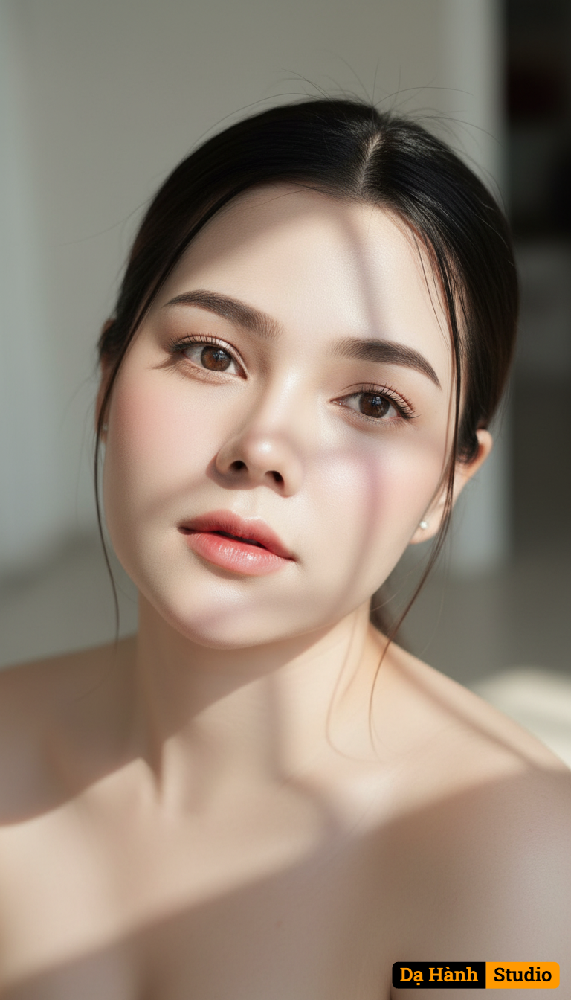

# AI Generated Image

## Details
- **Prompt:** `Create a sharp, ultra high-resolution large format portrait (9:16 aspect ratio). Use the uploaded reference photo as the exact basis for the face, keeping all facial proportions — eyes, nose, mouth, and overall structure — perfectly preserved without alteration. Change only the style according to the following description:

A surreal, cinematic top-down angle photo that focuses on the character’s face and bare shoulders. She has flawless porcelain-white skin with a natural glow, subtle blush, and long, thin lashes framing her serene eyes. Her black hair is neatly tied back, with a few strands falling gracefully around her face. Soft sunlight filters down, casting artistic vertical or gridded shadows on her face and shoulders, highlighting her delicate features and creating a dreamy, graceful atmosphere. Her bare shoulders emphasize elegance, purity, and innocence. Rendered in cinematic style — gentle, expressive, photorealistic, masterpiece quality`
- **Category:** Nhân vật
- **Source Image:** [View Source](https://raw.githubusercontent.com/lenzcomvth/ImageLibrary/main/Female.png)

## Image
