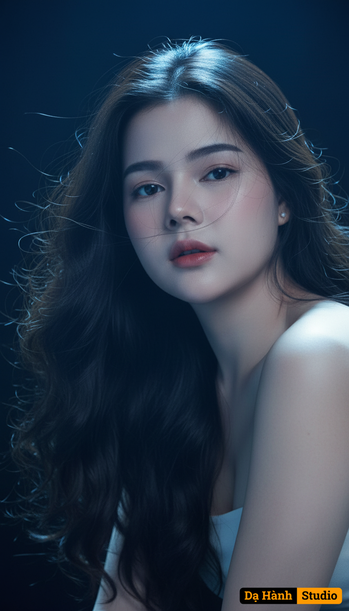

# AI Generated Image

## Details
- **Prompt:** `Giữ nguyên vecter khuôn mặt của người mẫu cho tôi . Chân dung studio 8K siêu sắc nét của một người phụ nữ Đông Á trẻ trung xinh đẹp, có thể là tuổi thiếu niên hoặc đầu đôi mươi, với mái tóc dài, đen, sóng. Lông mày mỏng, nhạt.
Tạo dáng/Biểu cảm: Cô ấy trông hơi ra khỏi ống kính với biểu cảm thanh thản, có thể là đắt tiền hoặc hơi u sầu. Đầu cô ấy hơi nghiêng. Đôi vai của cô ấy trần trụi, gợi ý vẻ ngoài không áo hoặc trễ vai, thu hút sự chú ý đến khuôn mặt và mái tóc của cô ấy.
Tóc: dài, đen, và chảy. Tóc được tạo kiểu một cách tự nhiên, hơi bị gió hoặc thả, với các sợi riêng lẻ bắt ánh sáng và một số xuất hiện bồng bềnh quanh khuôn mặt và đầu của cô ấy.
Trang điểm: Tự nhiên và tinh tế, làm nổi bật nét tự nhiên của nàng.
Nền: Rất tối, gần như đen, và hoàn toàn mất tập trung, cách ly đối tượng và nhấn mạnh ánh sáng kịch tính.
Ánh sáng: Tông màu xanh tạo cảm giác cô đơn lạnh. Ánh sáng làm nổi bật khuôn mặt cô ấy. Kịch tính và nghệ thuật. Nguồn ánh sáng chính đến từ trên cao và hơi phía sau cô bé, tạo hiệu ứng hào quang trên mái tóc và điểm nhấn mạnh mẽ trên trán, cầu mũi và gò má. Khuôn mặt của cô ấy cũng sáng nhẹ nhàng, nhưng ấn tượng tổng thể là một sự thiết lập ánh sáng dịu dàng, đầy ắp. Ánh sáng khiến mái tóc của cô ấy trông như nó có một ánh sáng mềm mại và một vài sợi tóc dường như đang bồng bềnh.
Ambiance/Tâm trạng: Tinh tế, mơ mộng, bí ẩn, tinh tế và thanh lịch.
Sáng tác: Chân dung cận cảnh, tập trung vào khuôn mặt, tóc và vai. Khung khung chặt chẽ, nhấn mạnh sự gần gũi.
Phong cách: chân dung người đẹp mang chút tưởng tượng hoặc chủ nghĩa siêu thực.`
- **Category:** Nhân vật
- **Source Image:** [View Source](https://raw.githubusercontent.com/lenzcomvth/ImageLibrary/main/Female.png)

## Image
