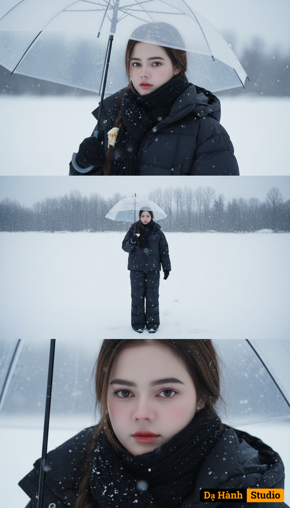

# AI Generated Image

## Details
- **Prompt:** `Create a vertical frame-size 2160x3840 pixels (4K quality), divided into three equally sized horizontal images placed together.
The main character must keep the exact uploaded reference face (Face-Lock 100%) and hairstyle (Hair-Lock 100%). No changes or alterations to facial structure.
The outfit is a loose winter puffer set with wide-leg pants and a black scarf. The atmosphere is snowy, with a cold color palette that conveys solitude and melancholy.
Image 1 (portrait):
The character holds a transparent umbrella, turning their head slightly back while looking directly at the frame. Expression: subtle sadness, nostalgic aura. Background: snowy whiteness, softly blurred.
Image 2 (full body):
The character stands alone in a vast snowy field, holding the umbrella. Camera angle from above, as if the character raises one hand to catch falling snowflakes. In the distance, leafless trees enhance the feeling of isolation.
Image 3 (close-up):
A zoomed-in shot of the character’s eyes. Keep the exact uploaded face (Face-Lock 100%), but the gaze conveys sorrow and longing. Snowflakes softly fall around.`
- **Category:** Nhân vật
- **Source Image:** [View Source](https://raw.githubusercontent.com/lenzcomvth/ImageLibrary/main/Female.png)

## Image
