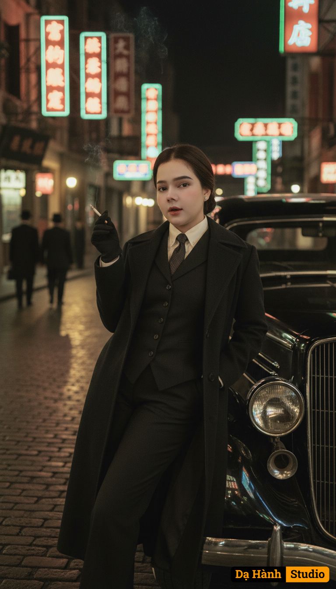

# AI Generated Image

## Details
- **Prompt:** `Create a photorealistic cinematic portrait using the uploaded photo.
Keep my real face exactly as in the uploaded photo; do not alter my facial features.
Scene: A retro 1930s Shanghai street at night with neon Chinese signs glowing, cobblestone road, and people in vintage attire.
Outfit: I am wearing a dark vintage three-piece suit with long overcoat, white shirt, and tie.
Pose: Leaning casually against a classic 1930s black car, holding a cigarette with smoke rising.
Style: cinematic, noir-inspired, moody atmosphere, with warm streetlights and filmic color grading.
Ultra-HD, realistic, stylish, resembling a historical movie still.`
- **Category:** Nhân vật
- **Source Image:** [View Source](https://raw.githubusercontent.com/lenzcomvth/ImageLibrary/main/Female.png)

## Image
