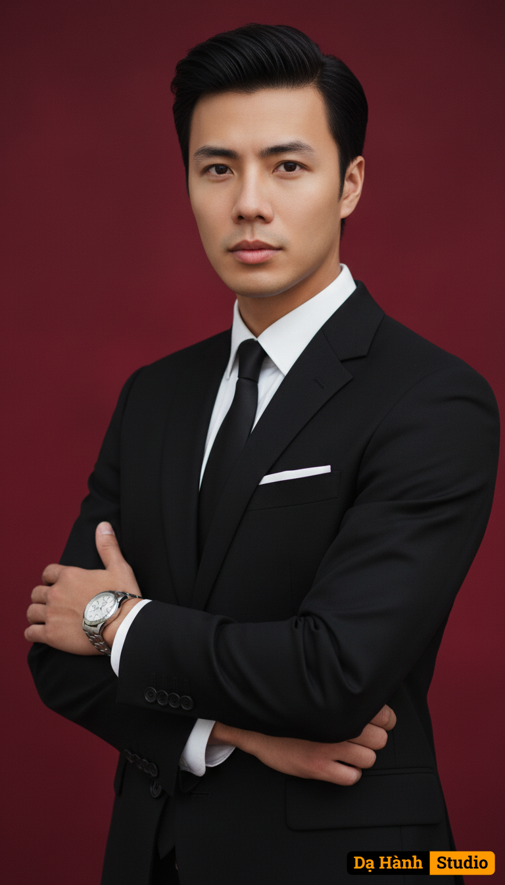

# AI Generated Image

## Details
- **Prompt:** `Vertical portrait, portrait-ratio frame, cropped from waist-up. Subject is a young man, face looking straight into the lens with a serious, confident expression, lips closed. Body slightly turned 3/4 but head and eyes straight ahead. Wearing a black tailored suit, white shirt with a standard collar, black tie with a neat knot (four-in-hand or equivalent). White pocket square folded straight (presidential fold) in the left breast pocket. Arms crossed: left hand placed across the right arm, left fingers straight and clearly visible; right hand slightly hidden under the left hand. Silver metal wrist watch on the left wrist, linked eye chain, clear round face. Black hair, neatly combed, slightly puffed at the top, modern style. Light skin, neutral tone. Rich crimson background, soft, diffused, even light highlighting the face and the texture of the suit fabric, slight realistic shine. 85mm equivalent lens angle, low aperture for background blur, photorealistic, ultra-realistic, high-detail, 8k, RAW`
- **Category:** Nhân vật
- **Source Image:** [View Source](https://raw.githubusercontent.com/lenzcomvth/ImageLibrary/main/Male.png)

## Image
