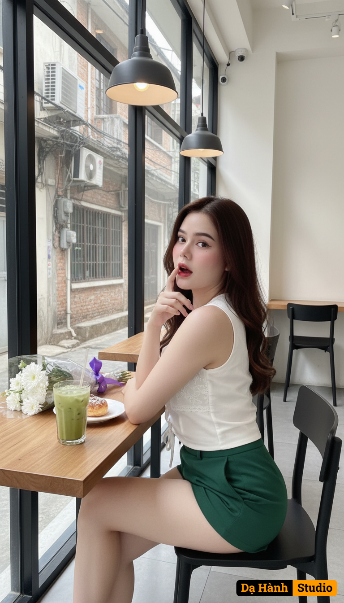

# AI Generated Image

## Details
- **Prompt:** `Ultra photorealistic fashion portrait of the same woman from the reference photo, identity locked (do not alter facial features). A young woman sitting by the window in a modern café, posing with a slightly surprised and playful expression, her index finger gently touching her lips. She has long, wavy, dark brown hair styled naturally, flowing over her shoulders. Her face is delicate with fair skin, soft makeup, and a light pink blush on her cheeks, giving her a fresh and youthful look. She wears a sleeveless, fitted white blouse with lace details and a tied front, paired with short dark green high-waisted shorts. The camera angle is at eye level, capturing her in a side-profile pose, slightly turning her head towards the camera, emphasizing her expressive eyes. Natural daylight streams in through the large glass window beside her, casting soft, even lighting on her face and body. On the wooden table in front of her, there is a clear glass of iced green drink with a straw, a small plate with a pastry, and a bouquet of fresh white flowers wrapped in transparent plastic with a purple ribbon. Behind her, the café interior is modern and minimalistic with grey tiled flooring, stylish hanging lamps, black chairs, and a clean, bright atmosphere. Outside the window, a small alley with old buildings and air conditioning units is visible, adding contrast to the cozy indoor setting. Photo-realistic, high detail, natural light, candid and intimate atmosphere. The background is simple with soft neutral tones, resembling a lifestyle magazine shoot. Ultra realistic, photorealistic details, 9:16 aspect ratio, 8K resolution, highly detailed, masterpiece. `
- **Category:** Nhân vật
- **Source Image:** [View Source](https://raw.githubusercontent.com/lenzcomvth/ImageLibrary/main/Female.png)

## Image
