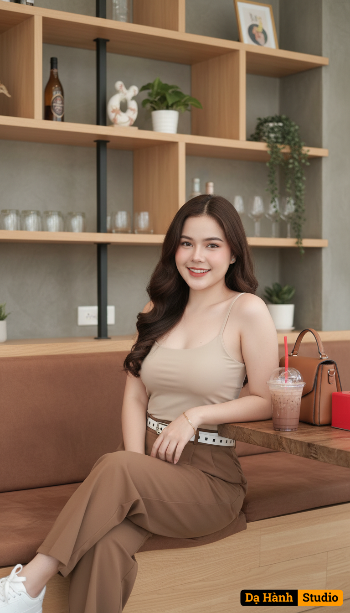

# AI Generated Image

## Details
- **Prompt:** `Ultra photorealistic fashion portrait of the same woman from the reference photo, identity locked (do not alter facial features). A young woman sitting casually inside a cozy modern café with wooden interior and shelves filled with drinks and decorations in the background. She is sitting sideways on a cushioned bench, one leg folded onto the seat and the other relaxed, leaning her left arm on the wooden table beside her. She has long, wavy, dark brown hair parted to the side, flowing naturally over her shoulders. Her face is softly lit, showing smooth skin, gentle makeup, and a warm, cheerful smile with a calm and relaxed expression.
She is wearing a fitted beige spaghetti strap tank top, paired with high-waisted loose brown trousers and a white belt with black square patterns. On her wrist, she wears a gold bracelet, and she also has small, elegant earrings. She has white sneakers on her feet, slightly visible under the loose trousers. On the table next to her, there is a transparent plastic cup with iced chocolate drink and a red straw, along with a brown handbag and a bright red tissue box. The lighting is natural and soft, highlighting her skin tone and creating a warm, welcoming café atmosphere. The camera angle is eye-level, capturing her upper body and surroundings in a natural, candid style. The background is simple with soft neutral tones, resembling a lifestyle magazine shoot. Ultra realistic, photorealistic details, 9:16 aspect ratio, 8K resolution, highly detailed, masterpiece`
- **Category:** Nhân vật
- **Source Image:** [View Source](https://raw.githubusercontent.com/lenzcomvth/ImageLibrary/main/Female.png)

## Image
