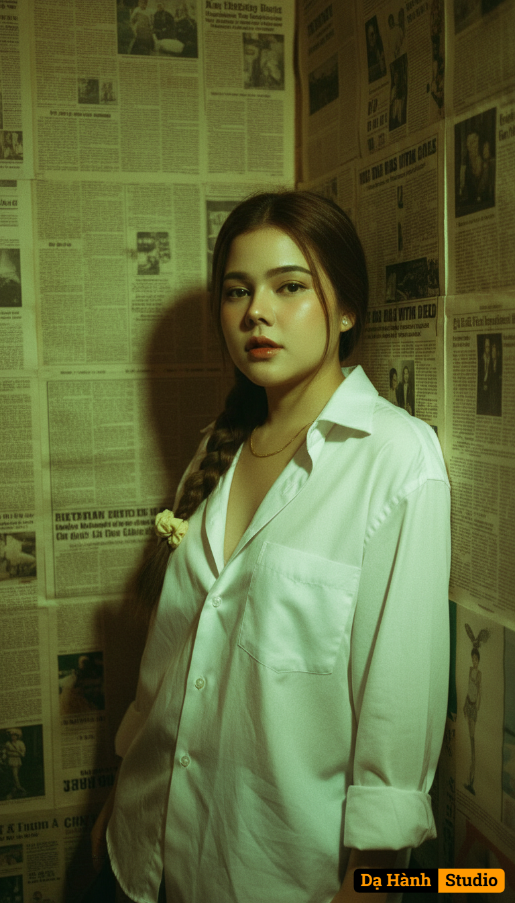

# AI Generated Image

## Details
- **Prompt:** `Create a retro Hong Kong–style portrait with an authentic 1990s film aesthetic. Use the attached image as a facial reference. Half-body composition. The subject leans against a wall covered with old newspapers, wearing a loose white shirt with the top button casually undone.
Skin appears dewy and luminous. The setting is a small Hong Kong room, with walls covered in aged, yellowing English newspapers.
Tungsten lighting casts a soft golden glow mixed with a hint of green, creating deep shadows and bright highlights.`
- **Category:** Nhân vật
- **Source Image:** [View Source](https://raw.githubusercontent.com/lenzcomvth/ImageLibrary/main/Female.png)

## Image
