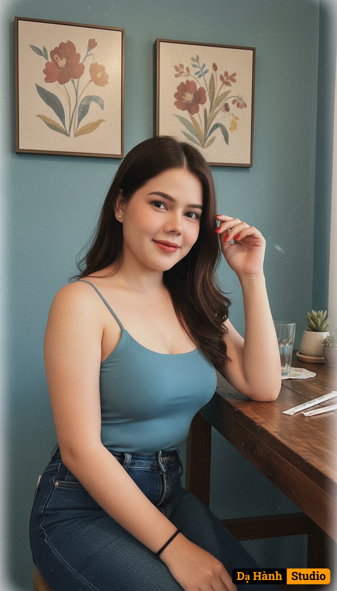

# AI Generated Image

## Details
- **Prompt:** `A hyper-realistic medium close-up portrait of the uploaded person (preserve identity, facial features, and likeness exactly, do not alter the face). Framed from the waist up at a slightly high angle with a subtle Dutch tilt, the subject sits at a rustic dark-stained wooden bar, torso angled slightly away with the left shoulder closer to the camera, head turned toward the lens with a gentle, friendly smile. The right forearm rests casually on the wooden surface while the left hand is raised, fingers lightly touching the hair near the face, gaze directed straight into the camera. Lighting is soft, diffused artificial indoor light from the front-left, creating subtle shadows that define contours, giving a warm peach-orange skin tone with healthy highlights and cool undertones in the shadows. Style: vintage film aesthetic with fine grain, slightly muted colors, shallow depth of field, soft background blur, and light vignette.Outfit: fitted dusty blue/teal spaghetti strap tank top with dark blue denim jeans (metal rivets/buttons visible). Accessories: thin black elastic bracelet on left wrist, vibrant red nail polish. Background: dusty blue/teal textured wall with two framed abstract floral artworks in muted reds, browns, creams, and blues. Table details: clear glass with liquid, a small potted succulent, and wrapped chopsticks placed diagonally. Mood: casual, warm, inviting, subtly nostalgic, cinematic.`
- **Category:** Nhân vật
- **Source Image:** [View Source](https://raw.githubusercontent.com/lenzcomvth/ImageLibrary/main/Female.png)

## Image
